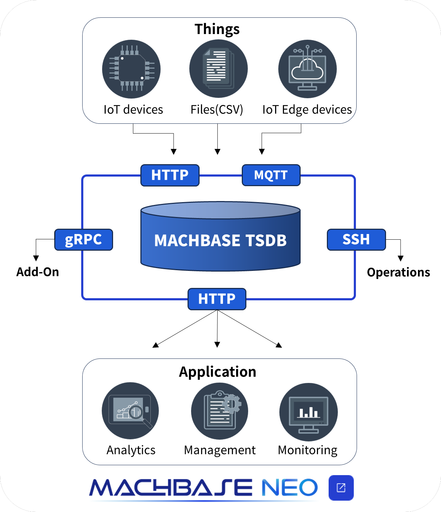
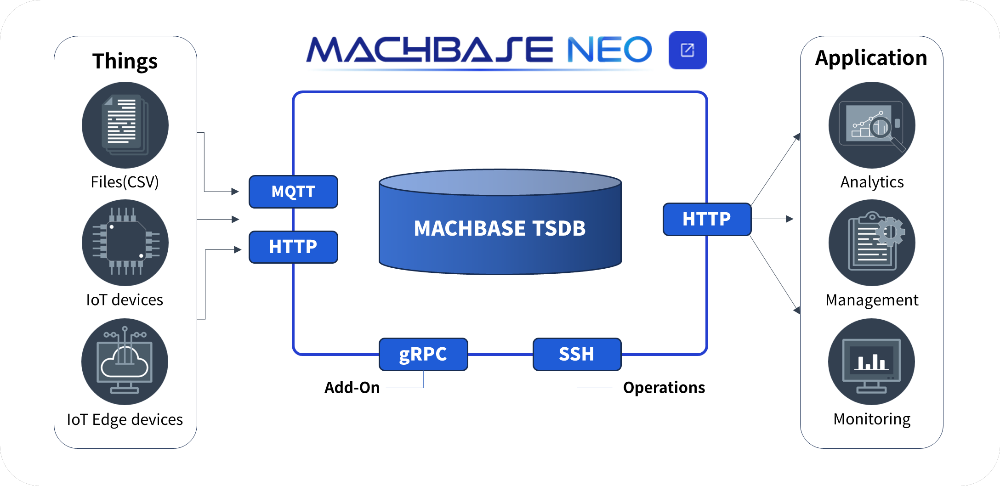

<head>
  <meta name="viewport" content="width=device-width, initial-scale=1.0" />
  <link rel="stylesheet" type="text/css" href="./css/common.css" />
  <link rel="stylesheet" type="text/css" href="./css/style.css" />
</head>

<section class="section1 main_section1 main_wrap">
  

    

      <h2 class="main_title">
        Mach Speed 
        Horizontally Scalable Time series database.
      </h2>
      <h2 class="main_titletext">
        “ Machbase is the world’s fastest timeseries database.
      </h2>
      

        It’s an ideal solution for environments that
      

      

        require scalability, from edge devices with limited resources 
        to clusters processing massive amounts of data."
      

      <h2 class="main_tablet_subtitle">
        “ Machbase is the world’s fastest timeseries database. It’s an ideal
        solution for environments that require scalability, from edge devices
        with limited resources to clusters processing massive amounts of data."
      </h2>
    

    

      

        
      

      

        
      

    

    

      

        
      

      

        
      

    

  

</section>
<section class="section2 main_section2">
  

    <h4 class="sub_title main_margin_top">Why Machbase?</h4>
    

  

  

    

      

        
The World-best Performance

        
      

      

        <ul>
          <li class="main_why_contents">
            TPCx IoT Performance Ranked #1 Worldwide since November 2019(IoT
            sensor data processing performance of 5 million IOP on January 2023)
          </li>
          <li class="main_why_contents">
            10x lower CPU/memory investment than Hadoop
          </li>
          <li class="main_why_contents">
            Dozens of times more compression efficiency than traditional RDBMS
            and Hadoop
          </li>
          <li class="main_why_contents">
            Support for Different Operating Systems and CPUs
          </li>
        </ul>
      

      

        

          
            <a href="/home/company#performance" class="main_why_more"
              >View More</a
            >
          
        

      

    

    

      

        
Edge Computing

        
      

      

        <ul>
          <li class="main_why_contents">
            Data insertion performance exceeding 400,000/sec on Raspberry Pi 4
          </li>
          <li class="main_why_contents">
            Best performance on any device, from edge devices to clusters
          </li>
          <li class="main_why_contents">
            The highest scalability with a simple architecture
          </li>
          <li class="main_why_contents">
            Provides an efficient way to develop learning and inference
            applications between DBMS and AI applications
          </li>
        </ul>
      

      

        

          
            <a target="" class="main_why_more" href="/home/edge">
              View More<ArrowSvg />
            </a>
          
        

      

    

    

      

        
Solving Developer Pain Points

        
      

      

        <ul>
          <li class="main_why_contents">
            Provide a powerful built-in data transformation language (TQL).
          </li>
          <li class="main_why_contents">Provide worksheet functionality.</li>
          <li class="main_why_contents">Provide visualization.</li>
          <li class="main_why_contents">Support embedded broker</li>
          <li class="main_why_contents">Support standard security features.</li>
        </ul>
      

      

        
          <a class="main_why_more" href="/home/tsdb#scroll2">View More</a>
        
      

    

  

</section>
<section class="main_section3">
  

    <h4 class="sub_title section3_subtitle">Machbase TSDB (Neo)</h4>
    

    <!--[ Download & Install]
 -->
  

  

    

      <button
        class="left-btn"
        data-target="download"
        onclick="clickLeftTab('download')"
      >
        Download
      </button>
      <button
        class="left-btn"
        data-target="start"
        onclick="clickLeftTab('start')"
      >
        Start Up
      </button>
      <button
        class="left-btn"
        data-target="create"
        onclick="clickLeftTab('create')"
      >
        Create Table
      </button>
      <button
        class="left-btn"
        data-target="insert"
        onclick="clickLeftTab('insert')"
      >
        Insert
      </button>
      <button
        class="left-btn"
        data-target="select"
        onclick="clickLeftTab('select')"
      >
        Select
      </button>
    

    

      

        <!-- [ Download & Install ] -->
        

          

            <button
              class="btn1"
              data-target="download1"
              onclick="clickHeaderTab('linux')"
            >
              Linux / Mac
            </button>
            <button
              class="btn1"
              data-target="download2"
              onclick="clickHeaderTab('window')"
            >
              Windows
            </button>
            <button
              class="btn1"
              data-target="download4"
              onclick="clickHeaderTab('all')"
            >
              All releases
            </button>
          

          

            

              

                

                  # Download pakcage 
                

                

                  $
                  

                    sh -c "$(curl -fsSL https://machbase.com/install.sh)"
                  

                  <button data-code="download1" class="copy-btn3 btn_up">
                    Copy
                  </button>
                

              

              

                

                  # Unarchive 
                

                

                  $
                  
unzip machbase-neo-*.zip

                  <button data-code="download2" class="copy-btn3 btn_up">
                    Copy
                  </button>
                

              

            

            

              

                &lt;Click on the link below to download&gt; 
                <a
                  href="https://github.com/machbase/neo-server/releases/download//machbase-neo--windows-amd64.zip"
                  class="orange home_visited"
                  target="_blank"
                  >machbase-neo-v8.0.3-windows-amd64.zip</a
                >
              

            

            

              

                &lt;Download from releases&gt; 
                <a
                  class="orange home_visited"
                  href="https://machbase.com/neo/releases/"
                  >https://machbase.com/neo/releases/</a
                >
              

            

          

        

        

          

            <button
              class="btn1"
              data-target="start1"
              onclick="clickHeaderTab('start')"
            >
              Start Up
            </button>
          

          

            

              

                # Start 
              

              

                $
                
machbase-neo serve

                <button data-code="start" class="copy-btn3 btn_up">Copy</button>
              

            

          

        

        

          

            <button
              class="btn1"
              data-target="create1"
              onclick="clickHeaderTab('neoShell')"
            >
              Neo Shell
            </button>
            <button
              class="btn1"
              data-target="create2"
              onclick="clickHeaderTab('curl')"
            >
              Curl
            </button>
          

          

            

              

                machbase-neo shell sql \ 
                  &nbsp;&nbsp;'create tag table EXAMPLE (\ 
                    &nbsp;&nbsp;&nbsp;&nbsp;name varchar(40) primary key, \ 
                    &nbsp;&nbsp;&nbsp;&nbsp;time datetime basetime, \ 
                    &nbsp;&nbsp;&nbsp;&nbsp;value double \ 
                    &nbsp;&nbsp;)'
              

              <button class="copy-btn3" data-code="createShell">Copy</button>
            

            

              

                curl
                  http://127.0.0.1:5654/db/query
                  \ 
                  &nbsp;&nbsp;&nbsp;&nbsp;--data-urlencode
                  \ 
                  &nbsp;&nbsp;&nbsp;&nbsp;"q=create tag table EXAMPLE (name varchar(40) primary key,
                    time datetime basetime, value double)"
              

              <button data-code="createCurl" class="copy-btn3">Copy</button>
            

          

        

        

          

            <button
              class="btn1"
              data-target="insert1"
              onclick="clickHeaderTab('insertNeoShell')"
            >
              Neo Shell
            </button>
            <button
              class="btn1"
              data-target="insert2"
              onclick="clickHeaderTab('insertCurl')"
            >
              Curl
            </button>
            <button
              class="btn1"
              data-target="insert3"
              onclick="clickHeaderTab('insertPython')"
            >
              Python
            </button>
            <button
              class="btn1"
              data-target="insert4"
              onclick="clickHeaderTab('insertJavaScript')"
            >
              JavaScript
            </button>
            <button
              class="btn1"
              data-target="insert5"
              onclick="clickHeaderTab('insertGo')"
            >
              Go
            </button>
            <button
              class="btn1"
              data-target="insert6"
              onclick="clickHeaderTab('insertCSharp')"
            >
              C#
            </button>
          

          

            

              

                machbase-neo shell sql \ 
                &nbsp;"insert into EXAMPLE values('temperature',
                  1670380342000000000, 12.3456)"
              

              <button data-code="insertShell" class="copy-btn3">Copy</button>
            

            

              

                curl
                http://127.0.0.1:5654/db/query
                \ 
                &nbsp;&nbsp;--data-urlencode \ 
                &nbsp;&nbsp;"q=insert into EXAMPLE values('temperature',
                  1670380342000000000, 12.3456)"
              

              <button data-code="insertCurl" class="copy-btn3">Copy</button>
            

            

              

                import 
                requests 
                  csvdata
                =
                "temperature,1670380342000000000,12.3456" 
                response =
                requests.post( 
                &nbsp;&nbsp;&nbsp;&nbsp;"http://127.0.0.1:5654/db/write/EXAMPLE?heading=false",
                 
                &nbsp;&nbsp;&nbsp;&nbsp;data=csvdata,
                 
                &nbsp;&nbsp;&nbsp;&nbsp;headers={'Content-Type': 'text/csv'})
              

              <button data-code="insertPy" class="copy-btn3">Copy</button>
            

            

              

                q =
                "select * from example" 
                fetch(`http://127.0.0.1:5654/db/query?q=${encodeURIComponent(q)}`) 
                &nbsp;&nbsp;.then(res
                => { 
                &nbsp;&nbsp;&nbsp;return 
                res.json(); 
                &nbsp;&nbsp;}) 
                &nbsp;&nbsp;.then(data
                => { 
                &nbsp;&nbsp;&nbsp;console.log(data) 
                &nbsp;&nbsp;});
              

              <button data-code="insertJs" class="copy-btn3">Copy</button>
            

            

              

                package main 
                import ( 
                &nbsp;&nbsp;&nbsp;&nbsp;&nbsp;&nbsp;&nbsp;&nbsp;"net/http" 
                  &nbsp;&nbsp;&nbsp;&nbsp;&nbsp;&nbsp;&nbsp;&nbsp;"bytes" 
                  &nbsp;&nbsp;&nbsp;&nbsp;&nbsp;&nbsp;&nbsp;&nbsp;"strings"  ) 
                func
                main() { 
                &nbsp;&nbsp;&nbsp;&nbsp;rows :=
                []string{
                "temperature,1670380342000000000,12.3456"} 
                &nbsp;&nbsp;&nbsp;&nbsp;http.Post( 
                &nbsp;&nbsp;&nbsp;&nbsp;&nbsp;&nbsp;&nbsp;&nbsp;"http://127.0.0.1:5654/db/write/EXAMPLE?heading=false", 
                &nbsp;&nbsp;&nbsp;&nbsp;&nbsp;&nbsp;&nbsp;&nbsp;"text/csv", 
                &nbsp;&nbsp;&nbsp;&nbsp;&nbsp;&nbsp;&nbsp;&nbsp;bytes.NewBufferString(strings.Join(rows,
                "\n"))) }
              

              <button data-code="insertGo" class="copy-btn3">Copy</button>
            

            

              

                using 
                HttpClient client =
                new(); 
                 
                var 
                payload =
                new 
                System.Net.Http.StringContent( 
                &nbsp;&nbsp;&nbsp;&nbsp;@"temperature,1677033057000000000,21.1 
                  &nbsp;&nbsp;&nbsp;&nbsp;humidity,1677033057000000000,0.53", 
                &nbsp;&nbsp;&nbsp;&nbsp;new 
                System.Net.Http.Headers.MediaTypeHeaderValue("text/csv")); 
                 
                var 
                rsp =
                await 
                client.PostAsync( 
                &nbsp;&nbsp;&nbsp;&nbsp;"http://127.0.0.1:5654/db/write/example?heading=false", payload 
                ); 
              

              <button data-code="insertC" class="copy-btn3">Copy</button>
            

          

        

        

          

            <button
              class="btn1"
              data-target="select1"
              onclick="clickHeaderTab('selectNeoShell')"
            >
              Neo Shell
            </button>
            <button
              class="btn1"
              data-target="select2"
              onclick="clickHeaderTab('selectCurl')"
            >
              Curl
            </button>
            <button
              class="btn1"
              data-target="select3"
              onclick="clickHeaderTab('selectPython')"
            >
              Python
            </button>
            <button
              class="btn1"
              data-target="select4"
              onclick="clickHeaderTab('selectJavaScript')"
            >
              JavaScript
            </button>
            <button
              class="btn1"
              data-target="select5"
              onclick="clickHeaderTab('selectGo')"
            >
              Go
            </button>
            <button
              class="btn1"
              data-target="select6"
              onclick="clickHeaderTab('selectCSharp')"
            >
              C#
            </button>
          

          

            

              

                machbase-neo shell sql
                'select * from EXAMPLE'
              

              <button data-code="selectNeo" class="copy-btn3">Copy</button>
            

            

              

                curl
                http://127.0.0.1:5654/db/query
                \ 
                &nbsp;&nbsp;--data-urlencode "q=select * from EXAMPLE"
              

              <button data-code="insertCurl" class="copy-btn3">Copy</button>
            

            

              

                import 
                requests 
                params = {"q":"select * from example",
                "format":"csv",
                "heading":"false"}  
                response =
                requests.get("http://127.0.0.1:5654/db/query",
                params) 
                print(response.text) 
              

              <button data-code="selectPy" class="copy-btn3">Copy</button>
            

            

              

                q =
                "select * from example" 
                fetch(`http://127.0.0.1:5654/db/query?q=${encodeURIComponent(q)}`) 
                &nbsp;&nbsp;.then(res
                => { 
                &nbsp;&nbsp;&nbsp;return 
                res.json(); 
                &nbsp;&nbsp;}) 
                &nbsp;&nbsp;.then(data
                => { 
                &nbsp;&nbsp;&nbsp;console.log(data) 
                &nbsp;&nbsp;});
              

              <button data-code="selectJs" class="copy-btn3">Copy</button>
            

            

              

                package main 
                import ( 
                &nbsp;&nbsp;&nbsp;&nbsp;&nbsp;&nbsp;&nbsp;&nbsp;"net/http" 
                  &nbsp;&nbsp;&nbsp;&nbsp;&nbsp;&nbsp;&nbsp;&nbsp;"io" ) 
                func
                main() {
                 &nbsp;&nbsp;&nbsp;&nbsp;q :=
                url.QueryEscape("select * from example")  &nbsp;&nbsp;&nbsp;&nbsp;rsp,
                _ := http.Get("http://127.0.0.1:5654/db/query?format=csv&q="+q) 
                &nbsp;&nbsp;&nbsp;&nbsp;data,
                _ := io.ReadAll(rsp.Body) 
                &nbsp;&nbsp;&nbsp;&nbsp;fmt.Println(string(data))  }
              

              <button data-code="selectGo" class="copy-btn3">Copy</button>
            

            

              

                using 
                HttpClient client =
                new(); 
                 
                var q =
                System.Net.WebUtility.UrlEncode("select * from example"); 
                var data =
                await 
                client.GetStringAsync( 
                &nbsp;&nbsp;&nbsp;&nbsp;"http://127.0.0.1:5654/db/query?format=csv&q="+q 
                ); 
                Console.Write(data); 
              

              <button data-code="selectC" class="copy-btn3">Copy</button>
            

          

        

      

    

  

</section>
<section class="section5 main_section5">
  

    <h4 class="sub_title main_margin_top">Use Case</h4>
    

  

  

    

      

        
      

      

        

          Machbase was able to provide a real-time monitoring service by
          collecting and storing CSV files containing data from sensors on ship
          engines through a schema structure that fits time series data.
        

      

      

        

          
            <a class="main_usecase_more" href="/home/usecase/usecase1">
              View More<ArrowSvg />
            </a>
          
        

      

    

    

      

        
      

      

        

          Using Machbase Time Series DB, we shortened the timeframe of a project
          to build an energy big data platform that collects and stores
          real-time power data to develop deep learning algorithms.
        

      

      

        

          
            <a class="main_usecase_more" href="/home/usecase/usecase4">
              View More<ArrowSvg />
            </a>
          
        

      

    

    

      

        
      

      

        

          Machbase's reliable cluster operation has enabled Carrot's mileage
          insurance, which uses IoT devices, to collect real-time information on
          subscribers' vehicle operations and charge premiums based on that
          information.
        

      

      

        
          <a class="main_usecase_more" href="/home/usecase/usecase6"
            >View More<ArrowSvg />
          </a>
        
      

    

  

</section>
<section>
  

    <h4 class="sub_title main_margin_top">Meet the Machbase Neo</h4>
    

  

  

    <iframe
      width="1080"
      height="612"
      src="https://www.youtube.com/embed/1DR1TohMOc4?si=kNqjVRGDrmVhSaU3"
      title="YouTube video player"
      frameborder="0"
      allow="accelerometer; autoplay; clipboard-write; encrypted-media; gyroscope; picture-in-picture; web-share"
      allowfullscreen
    ></iframe>
  

</section>


