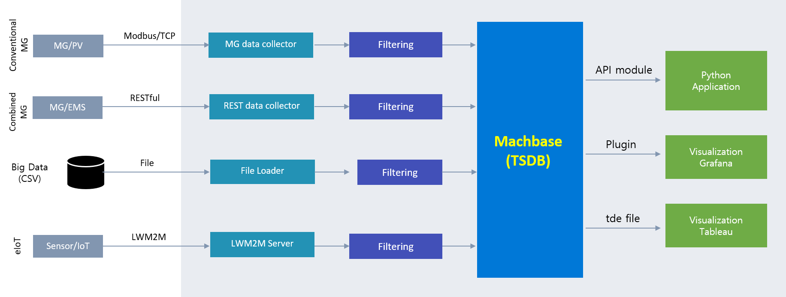

---
---

<head>
  <meta charset="UTF-8" />
  <meta name="viewport" content="width=device-width, initial-scale=1.0" />
  <link rel="stylesheet" type="text/css" href="../../css/common.css" />
  <link rel="stylesheet" type="text/css" href="../../css/style.css" />
</head>
<nav>
  

    

      <ul class="menu-left-ul">
        <li class="menu-logo">
          
        </li>
        <li class="menu-a products-menu-wrap" id="productsMenuWrap">
          

            <a
              class="menu_active_border"
              id="menuActiveBorder"
              href="/home/tsdb"
              >Products</a
            >
            

              <a class="dropdown-link" href="/home/tsdb">TSDB</a>
              <a class="dropdown-link" href="/home/mos">MOS</a>
              <a
                class="dropdown-link"
                href="https://www.cems.ai/"
                target="_blank"
                >CEMS</a
              >
            

          

        </li>
        <li class="menu-a"><a href="/">Docs</a></li>
        <li class="menu-a"><a href="/home/blog">Blog</a></li>
        <li class="menu-a"><a href="/home/customers">Customers</a></li>
        <li class="menu-a"><a href="/home/usecase">Use Case</a></li>
        <li class="menu-a"><a href="/home/company">Company</a></li>
      </ul>
    

    

      <ul class="menu-right-ul">
        <li class="menu-a"><a href="/home/download">Download</a></li>
        <li class="menu-a"><a href="https://support.machbase.com/hc/en-us">Support</a></li>
        <li class="menu-a"><a href="/home/contactus">Contact US</a></li>
      </ul>
    

  

</nav>
<section class="usecase_section0">
  

    <h1 class="sub_page_title">Use Case</h1>
    

      Machbase products are the choice of the world's leading companies and are
      in use in countless locations.
    

  

</section>
<section>
  

    <section>
      

        <h4 class="blog-title">[Machbase Use Case]Public - ETRI</h4>
        <ul class="tech-list-ul">
          <a href="#anchor1">
            <li class="tech-list-li" id="tech-list-li">Company Profile</li>
          </a>
          <a href="#anchor2">
            <li class="tech-list-li" id="tech-list-li">Challenges</li>
          </a>
          <a href="#anchor3">
            <li class="tech-list-li" id="tech-list-li">Reason for Selection</li>
          </a>
          <a href="#anchor4">
            <li class="tech-list-li" id="tech-list-li">Solution</li>
          </a>
          <a href="#anchor5">
            <li class="tech-list-li" id="tech-list-li">Application Result</li>
          </a>
        </ul>
        

          

            

              
            

            
Before : Hadoop

            

              
            

            
After : Machbase TSDB

            
Company Profile

            

              ETRI is a research organization that conducts research and
              development on a wide range of digital transformation
              technologies, including information and communication.
            

            
Challenges

            

              They were working on a project to build an energy big data
              platform to collect electricity big data and develop deep learning
              algorithms. There were difficulties in integrating time series
              data from various electricity and energy data source equipment,
              and since the platform was built on open source, commercialization
              was slowed down due to incompatibility between open source
              packages and low technical maturity.
            

            
Reason for Selection

            

              Machbase Time Series DB eliminated the need to build a complex
              system with a single solution and provided data collection
              interfaces for a variety of data sources. It also made it easy to
              integrate with visualization solutions.
            

            
Solution

            

              For data collection, we provided a data collector to collect
              different data sources such as Modbus TCP, REST API, and CSV file,
              and collected and stored real-time power data using Machbase time
              series DB. We also provided drivers for Grafana integration and
              Python integration to analyze and monitor the collected data.
            

            
Application Result

            

              The simplicity of the platform architecture and the SQL support
              reduced the learning curve for existing developers, reducing the
              overall project duration from four months to two weeks, allowing
              the project to be completed on time.
            

          

        

      

    </section>
  

</section>
<footer>
  

    

      
      <a href="/home/contactus">
        <button class="contactus">Contact Us</button>
      </a>
    

    

      

        3003 North First street #206 San Jose, CA 95134. USA
      

    

    

      

        
MACHBASE.COM | sales@machbase.com | support@machbase.com

        

      

      

        

          
        

        

          
        

        

          
        

        

          
        

        

          
        

        

          
        

      

    

  

  

    

      
    

    

      

        3003 North First street #206 San Jose, CA 95134. USA
      

    

    

      

        
MACHBASE.COM | sales@machbase.com | support@machbase.com

      

      

        

          
        

        

          
        

        

          
        

        

          
        

        

          
        

        

          
        

      

      <a href="/home/contactus">
        <button class="contactus">Contact US</button>
      </a>
    

  

  

    
@2023 MACHBASE All rights reserved.

  

</footer>
