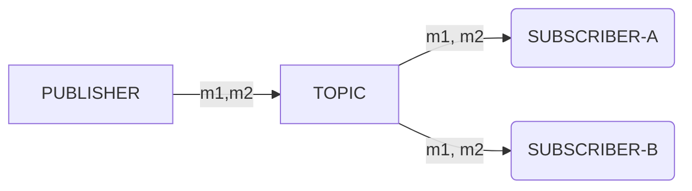
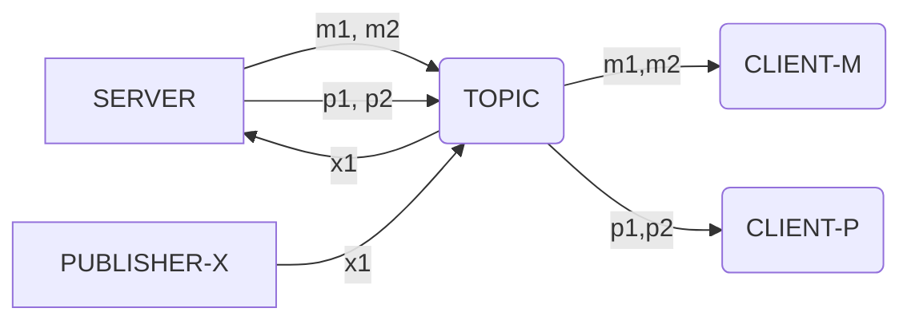
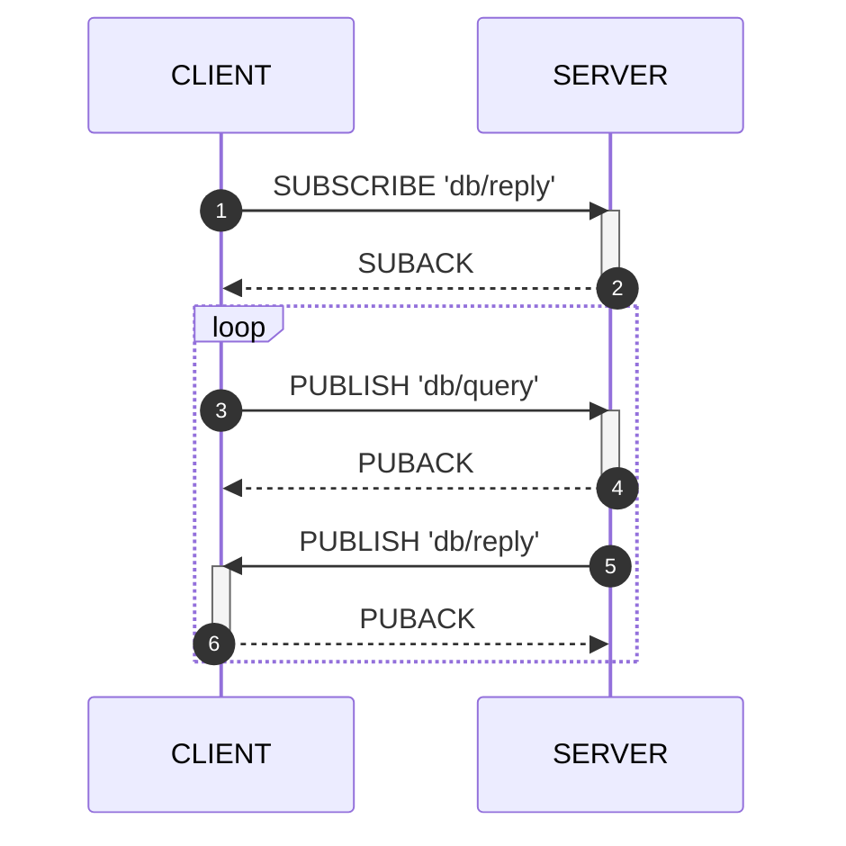

General purposed MQTT brokers deliver messages to all subscribers of the topic as diagram below. When a publisher sends message `M1`, `M2` to the `TOPIC`, both of `SUBSCRIBER-A` and `SUBSCRIBER-B` receive the same messages. 



In contrast with general MQTT brokers, machbase-neo delivers messages only if the publisher and subscriber share same connection (or session in terms of MQTT). This means machbase-neo MQTT is not working as a message broker, but it just uses MQTT as transport layer and subscription and publication is scoped per connection.

For example, while `CLIENT-M` and `CLIENT-P` subscribed to same `TOPIC` and waiting messages.
Server sends messages `M1` and `M2` to `TOPIC` that were inscribed to `CLIENT-M`.
Those messages are delivered only to `CLIENT-M` but `CLIENT-P` recevies `P1` and `P2` that were explicitly designated to it by server. If another client `PUBLISHER-X` sends `X1` to `TOPIC`, this `X1` will be delivered to server and the other clients will not know about this event.



Application needs a preparing step to query machbase-neo via MQTT which is subscribing to `db/reply`.
In the diagram below we shows general procedure assuming `CLIENT` uses QoS 1.
for the notes, machbase-neo support QoS 0, 1 of MQTT v3.1.1 specification.

After establised MQTT sesion by exchanging `CONNECT`and `CONNACK`, Client should subscribe to `db/reply` first before send query message to `db/query`, otherwise it can not receive any "query result".



The messages ➍, ➎ are sent by server asynchronous way which is nature of MQTT protocol. Then a client application shouldn't be implemented based specific order of those two messages.



If client is only publishing to `db/append` for writing data, it is not necessary to subscribe `db/reply`. This topic is required only for receiving query result.



## Sample code


**Define data structure for reponse**

```go
type Result struct {
	Success bool       `json:"success"`
	Reason  string     `json:"reason"`
	Elapse  string     `json:"elapse"`
	Data    ResultData `json:"data"`
}

type ResultData struct {
	Columns []string `json:"columns"`
	Types   []string `json:"types"`
	Rows    [][]any  `json:"rows"`
}
```

**Subscribe 'db/reply'**

```go
client.Subscribe("db/reply", 1, func(_ paho.Client, msg paho.Message) {
    buff := msg.Payload()
    result := Result{}
    if err := json.Unmarshal(buff, &result); err != nil {
        panic(err)
    }
    if !result.Success {
        fmt.Println("RECV: query failed:", result.Reason)
        return
    }
    if len(result.Data.Rows) == 0 {
        fmt.Println("Empty result")
        return
    }
    for i, rec := range result.Data.Rows {
        // do something for each record
        name := rec[0].(string)
        ts := time.Unix(0, int64(rec[1].(float64)))
        value := float64(rec[2].(float64))
        fmt.Println(i+1, name, ts, value)
    }
})
```

**Publish 'db/query'**

```go
jsonStr := `{ "q": "select * from EXAMPLE order by time desc limit 5" }`
client.Publish("db/query", 1, false, []byte(jsonStr))
```