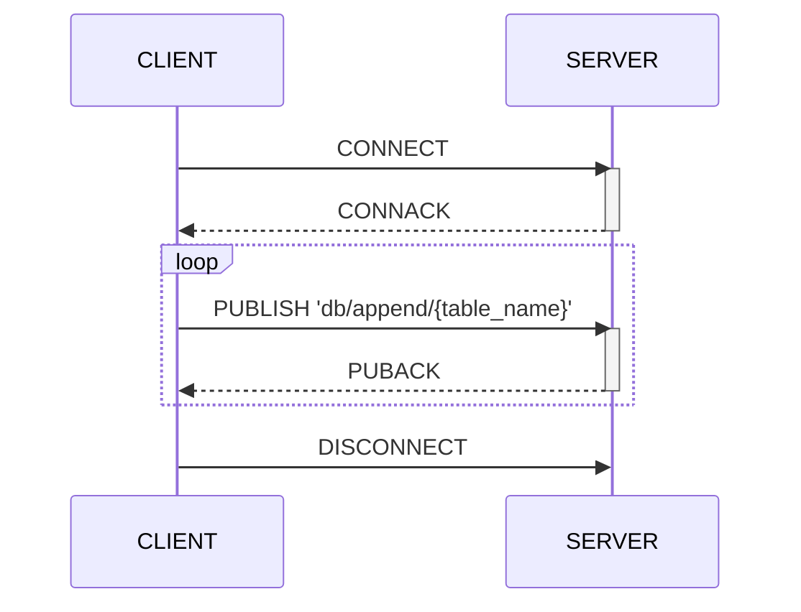

The examples below shows how to efficiently write data with mqtt client (`mosquitto_pub`).
The destination topic should be `db/append/`+table_name.



## Topic

The topic to write data is named with table name of the destination.

The full syntax of the topic is 

```
db/{method}/{table}:{format}:{compress}
```

**method**

There are two methods for writing data - `append` and `write`.
The `append` is recommened for the general situation of MQTT environment.

- `append` writing data in append mode
- `write` writing data in INSERT sql statement.

**format**

Current version of machbase-neo supports `json` and `csv`. The default format is `json`

- `json`
- `csv`

**compress**

Currently `gzip` is supported.

**examples**

- `db/append/EXAMPLE` means writing data to the table `EXAMPLE` in `append` method and the payload is JSON.

- `db/append/EXAMPLE:json` is equivalent the example above. The last `:json` part can be omitted, because `json` is the default format.

- `db/append/EXAMPLE:json:gzip` means writing data to the table `EXAMPLE` in `append` method and the payload is gzip compressed JSON.

- `db/append/EXAMPLE:csv` means writing data to the table `EXAMPLE` in `append` method and the payload is CSV.

- `db/write/EXAMPLE:csv` means writing data to the table `EXAMPLE` with `INSERT INTO...` SQL statement and the payload is CSV.

- `db/write/EXAMPLE:csv:gzip` means writing data to the table `EXAMPLE` with `INSERT INTO...` SQL statement and the payload is gzip compressed CSV.


## Payload formats

Compose the MQTT topic with table name, payload format and compression separated by colon(`:`) to use the payload other than plain JSON.


In this example, we use `mosquitto_pub` just for demonstration.
Since it makes a connection to MQTT server and close when it finishes to publish a single message.
You will barely see performance gains of `append` feature against HTTP `write` api.<br/>
Use this MQTT method only when a client can keep a connection relatively long time and send multiple messages.



### JSON

**PUBLISH multiple records**

```sh
mosquitto_pub -h 127.0.0.1 -p 5653 \
    -t db/append/EXAMPLE \
    -f ./mqtt-data.json
```

- mqtt-data.json

```json
[
    [ "my-car", 1670380342000000000, 32.1 ],
    [ "my-car", 1670380343000000000, 65.4 ],
    [ "my-car", 1670380344000000000, 76.5 ]
]
```

Payload form of above example is array of tuple (array of array in JSON), 
it appends the table with multiple records received through a mqtt message.
It is also possible to publish single tuple like below. 
Machbase Neo accepts both types of payload via mqtt.

**PUBLISH single record**

```sh
mosquitto_pub -h 127.0.0.1 -p 5653 \
    -t db/append/EXAMPLE \
    -m '[ "my-car", 1670380345000000000, 87.6 ]'
```

Since MQTT is connection oriented protocol, a client program can continuously send data while it keeps the same mqtt session.
It is the real benefit for using MQTT instead of HTTP for writing data.

### JSON gzip

Topic = Table + ':' + "json:gzip"

```sh
mosquitto_pub -h 127.0.0.1 -p 5653 \
    -t db/append/EXAMPLE:json:gzip \
    -f mqtt-data.json.gz
```

### CSV

Topic = Table + ':' + "csv"

> Since there is no way to tell machbase-neo whether the first line is header or data.
> The payload should not contain header.

```sh
mosquitto_pub -h 127.0.0.1 -p 5653 \
    -t db/append/EXAMPLE:csv \
    -f mqtt-data.csv
```

```
my-car,1670380346000000000,87.7
my-car,1670380347000000000,98.6
my-car,1670380348000000000,99.9
```

### CSV gzip

Topic = Table + ":csv:gzip"

```sh
mosquitto_pub -h 127.0.0.1 -p 5653 \
    -t db/append/EXAMPLE:csv:gzip \
    -f mqtt-data.csv.gz
```

## PUBLISH for INSERT INTO...

Topic `db/write/{table}` is for `INSERT`.


It is strongly recommended using `db/append/{table}` for the better performance through MQTT.
Refer this example of `db/write/{table}` only for the inevitable situation.


```sh
mosquitto_pub -h 127.0.0.1 -p 5653 \
    -t db/write/EXAMPLE \
    -f data-write.json
```

Since `db/write` works in `INSERT INTO...` SQL statement, it is required the columns in json payload.
The example of `data-write.json` is below.

```json {linenos=table,hl_lines=[3]}
{
  "data": {
    "columns": ["name", "time", "value"],
    "rows": [
      [ "wave.pi", 1687481466000000000, 1.2345],
      [ "wave.pi", 1687481467000000000, 3.1415]
    ]
  }
}
```

## PUBLISH to tql

Topic `db/tql/{file.tql}` is for transforming.

When the data transforming is required for writing into the database, prepare the proper *tql* script and publish the data to the topic named `db/tql/`+`{tql_file.tql}`.

Please refer to the [As Writing API](../../tql/writing) for the writing data via MQTT and *tql*.


## Max message size

The maximum size of payload in a PUBLISH message is 256MB by MQTT specification. If a malicious or malfunctioning client sends large messages continuously it can consume all of network bandwidth and computing resource of server side then it may lead server to out of service status. It is good practice to set max message limit as just little more than what client applications demand. The default mqtt max message size is 1MB (`1048576`), it can be adjusted by command line flag like below or `MaxMessageSizeLimit` in the configuration file.

```sh
machbase-neo serve --mqtt-max-message 1048576
```

