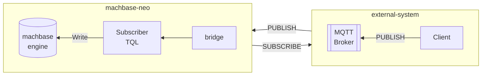

## Bridge

### Register a bridge

register sqlite connection

```
bridge add -t sqlite sqlitedb file:/data/sqlite.db;
```

### List registered bridges

```
bridge list
┌──────────┬────────┬────────────────────────┐
│ NAME     │ TYPE   │ CONNECTION             │
├──────────┼────────┼────────────────────────┤
│ sqlitedb │ sqlite │ file:/data/sqlite.db   │
└──────────┴────────┴────────────────────────┘
```

### Execute commands on the bridge

```
bridge exec sqlitedb CREATE TABLE IF NOT EXISTS example(id INTEGER NOT NULL PRIMARY KEY, name TEXT, age TEXT, address TEXT, UNIQUE(name));
```


### Query command on the bridge

> `bridge query` command is only works with "SQL" type bridges

```
bridge query sqlitedb select * from example;

┌────┬────────┬─────┬───────────────┐
│ ID │ NAME   │ AGE │ ADDRESS       │
├────┼────────┼─────┼───────────────┤
│  1 │ hong_1 │ 20  │ address for 1 │
│  2 │ hong_2 │ 20  │ address for 2 │
│  3 │ hong_3 │ 20  │ address for 3 │
└────┴────────┴─────┴───────────────┘
```


### Utilize a bridge in *tql* with `SQL()`

`SQL()` takes `bridge()` option with "SQL" type bridge and execute the given SQL statement.

```js
SQL(bridge("sqlitedb"), `select * from example`)
CSV()
```

### Utilize a bridge in *tql* `SCRIPT()`

Any type of bridge can be acceesible from `SCRIPT()` by getting bridge connection via `context.bridge()` function.

```js
SCRIPT({
  fmt := import("fmt")
  ctx := import("context")
  conn := ctx.bridge("sqlitedb")
  rows := conn.query("select * from example")
  for rows.next() {
    rec := rows.scan()
    ctx.yieldKey(rec.id, rec.name, rec.age, rec.address)
  }
  rows.close()
  conn.close()
})
CSV()
```

## Subscriber

The purpose of a *subscriber* is connecting to an external message broker system, receiving streaming messages, ingesting messages by *tql* script.

Currently machbase-neo supports connecting to the external MQTT brokers, and it will support also NATS and Kafka with the future releases.

A simple use case is that make a bridge to the external MQTT broker, and define a subscriber with 
1) the bridge, 2) a topic of the MQTT broker and 3) *tql* script path. Then machbase-neo works as 
MQTT client and whenever it receives messages, it passes them to the sepcified *tql* script.




### Register a subscriber

Register subscribers.

**Syntax:** `subscriber add [options] <name> <bridge> <topic> <tql-path>`

- options
    - `--autostart` makes the subscriber will start automatically when machbase-neo starts.
        If the subscriber is not *autostart* mode, you can make it start and stop manually by
        `subscriber start <name>` and `subscriber stop <name>` commands.
    - `--qos` if the bridge is MQTT type, specify the QoS level of the subscription to the topic.
        It supports `0`, `1` and the default is `0` if it is not specified.

- `<name>`      subscriber's name
- `<bridge>`    specify pre-defined bridge, it should be a type of the broker
- `<topic>`     topic to subscribe
- `<tql-path>`  the *tql* script that handles the received message


### Subscriber Status

**Syntax:** `subscriber list`

- `STOP`
- `RUNNING`

### Subscriber Start/Stop

**Syntax:** `subscriber [start | stop] <name>`

### Remove subscriber

**Syntax:** `subscriber del <name>`
