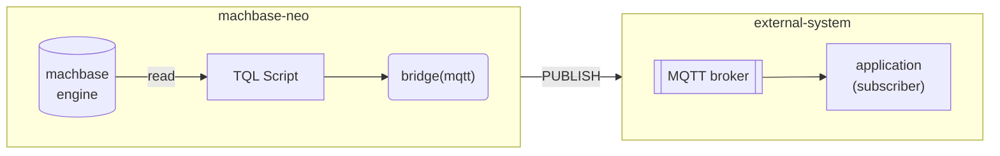
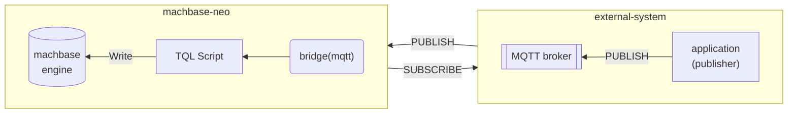
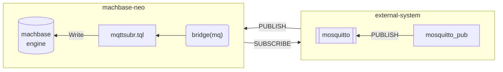

MQTT Bridge enables machbase-neo to send and receive message to/from any external MQTT brokers.


The beauty of the MQTT bridge comes when any existing "MQTT based" platforms adopt machbase-neo,
there is no changes required on the existing system.


- Send messages to external MQTT borker



- Receive messages from external MQTT broker



## Register a bridge to an external MQTT broker

Register a bridge

```
bridge add -t mqtt my_mqtt broker=127.0.0.1:1883 id=client-id;
```

A mqtt bridge just defines how machbase-neo can connect to the external MQTT broker,
See the subscriber section below to get it to receive messages.

Available connect options

| Option           | Description                          | example         |
| :-----------     | :---------------------------------   | :-------------  |
| `broker`         | brokder address, If the broker has redundant access points, use multiple "broker" options | `broker=192.0.1.100:1883` |
| `id`             | client id                            |                 |
| `username`       | username                             |                 |
| `password`       | password                             |                 |
| `keepalive`      | keepalive in duration format         | `keepalive=30s` |
| `clieansession`  | cleansesion                          | `cleansession=1` `cleansession=false` |
| `cafile`         | ca cert (`*.pem`) file path            |  *TLS*          |
| `key`            | client private key (`*.pem`) file path |  *TLS*          |
| `cert`           | client certificate (`*.pem`) file path |  *TLS*          |

> When all three of `cafile`, `key`, `cert` options are set, the secure mqtt connection is enabled with TLS.

## Send messages

Run `mosuqitto_sub` with debug mode (`-d`) option.
This will receive messages from topic 'neo/messages' via mosquitto broker
when machbase-neo publish messages to the topic.

```sh
mosquitto_sub -d -h 127.0.0.1 -p 1883 -i client-app -t neo/messages                                            1 ↵
Client client-app sending CONNECT
Client client-app received CONNACK (0)
Client client-app sending SUBSCRIBE (Mid: 1, Topic: neo/messages, QoS: 0, Options: 0x00)
Client client-app received SUBACK
Subscribed (mid: 1): 0
```

Make a *TQL* script that call the `publish()` function of the bridge.


**TIMER**
This example uses `FAKE()` and execute manually for the briefness,
the "publish" feature of bridges will be useful and powerful
when it combines with [Timer](/neo/timer/) to send data automatically by any given schedule.


```js {linenos=table,hl_lines=[4,5],linenostart=1}
FAKE(linspace(0,10, 5))
SCRIPT({
  ctx := import("context")
  br := ctx.bridge("my_mqtt")
  br.publish("neo/messages", "The message numser is "+ctx.value(0))
  ctx.yieldKey(ctx.key(), ctx.value()...)
})
CSV()
```

As soon as executing the script above the `mosquitto_sub` prints out the messages that it receives on the screen.

```sh
mosquitto_sub -d -h 127.0.0.1 -p 1883 -i client-app -t neo/messages                                            1 ↵
... omit ...
Client client-app received PUBLISH (d0, q0, r0, m0, 'neo/messages', ... (23 bytes))
The message numser is 0
Client client-app received PUBLISH (d0, q0, r0, m0, 'neo/messages', ... (25 bytes))
The message numser is 2.5
Client client-app received PUBLISH (d0, q0, r0, m0, 'neo/messages', ... (23 bytes))
The message numser is 5
Client client-app received PUBLISH (d0, q0, r0, m0, 'neo/messages', ... (25 bytes))
The message numser is 7.5
Client client-app received PUBLISH (d0, q0, r0, m0, 'neo/messages', ... (24 bytes))
The message numser is 10
```

## Receive messages - Subscriber

Let's make an example that receives messages from MQTT broker and storing the data into database utilizing bridage and subscriber.

In this demonstration we will use the `mosquitto` as MQTT broker and `mosquitto_pub` as MQTT client. These tools are simulating an "external" system.



### Run MQTT Broker

The MQTT bridge of machbase-neo should work with any MQTT broker that is compatible MQTT v3.1.1 specification.

If you don't have an installed MQTT broker, get and run *mosquitto* for the demo. [https://mosquitto.org](https://mosquitto.org)

```sh
$ mosquitto -p 1883

1691466522: mosquitto version 2.0.15 starting
1691466522: Using default config.
1691466522: Starting in local only mode. Connections will only be possible from clients running on this machine.
1691466522: Create a configuration file which defines a listener to allow remote access.
1691466522: For more details see https://mosquitto.org/documentation/authentication-methods/
1691466522: Opening ipv4 listen socket on port 1883.
1691466522: Opening ipv6 listen socket on port 1883.
1691466522: mosquitto version 2.0.15 running
```

### Register a bridge

Open machbase-neo shell, and execute `bridge add...` command.

```
bridge add -t mqtt my_mqtt broker=127.0.0.1:1883 id=demo;
```

It defines the way how machbase-neo can connect to the destinated broker.

```
machbase-neo» bridge list;
╭─────────┬──────────┬─────────────────────────────────╮
│ NAME    │ TYPE     │ CONNECTION                      │
├─────────┼──────────┼─────────────────────────────────┤
│ my_mqtt │ mqtt     │ broker=127.0.0.1:1883 id=demo   │
╰─────────┴──────────┴─────────────────────────────────╯
```

When the bridge `my_mqtt` successfuly registered, machbase-neo connects to the broker and mosquitto shows the connection log like below.

If there is any network problem or the broker is down, 
machbase-neo does periodically retry to connect,
so that it keeps the best efforts to make the bridge available.

```
1691466529: New connection from 127.0.0.1:65440 on port 1883.
1691466529: New client connected from 127.0.0.1:65440 as demo (p2, c1, k30).
```

### Data transforming script

Open machbase-neo *TQL* editor, and copy the code below and save it as `mqttsubr.tql`.

```js {linenos=table,linenostart=1}
BYTES(payload())
SCRIPT({
  // get current time
  times := import("times")
  ts := times.now()
  // get the payload of the message
  ctx := import("context")
  val := ctx.value()
  // parse json
  json := import("json")
  msg := json.decode(val[0])
  // yield key-value records
  ctx.yield(msg.client+".temp", ts, msg.data.temp)
  ctx.yield(msg.client+".humidity", ts, msg.data.humidity)
})
APPEND(table("example"))
```

This script gets the payload of incoming messages with `BYTES(payload())`.
It parses and transforms the data shape to write into the table `example` of machbase-neo.

First it gets current time to apply the timestamp with `ts := times.now()`, since the message doesn't have a timestamp.
Decode the JSON payload and yields two new records which are `.temp` and `.humidity`.

### Register a subscriber

Open machbase-neo shell to add a new subscriber which makes a pipeline between the bridge and the *tql* script.

It specifies ...
- `--autostart` makes the subscriber starts along with machbase-neo starts
- `--qos 1` subscribe to the topic QoS 1, MQTT bridges support QoS 0 and 1
- `mqttsubr` name of the subscriber
- `my_mqtt` name of bridge that the subscriber is going to use
- `iot/sensor` topic name to subscribe. it supports standard MQTT topic syntax includes `#` and `+`

```sh
subscriber add --autostart --qos 1 mqttsubr my_mqtt iot/sensor /mqttsubr.tql;
```

Check the newely register subscriber is in `RUNNING` state, since it is registered with `--autostart` option.

```
machbase-neo» subscriber list;
╭──────────┬─────────┬────────────┬───────────────┬───────────┬─────────╮
│ NAME     │ BRIDGE  │ TOPIC      │ TQL           │ AUTOSTART │ STATE   │
├──────────┼─────────┼────────────┼───────────────┼───────────┼─────────┤
│ MQTTSUBR │ my_mqtt │ iot/sensor │ /mqttsubr.tql │ true      │ RUNNING │
╰──────────┴─────────┴────────────┴───────────────┴───────────┴─────────╯
```

### Send messages with `mosquitto_pub`

Make a data file `data.json` as like below.

```json
{
  "client":"mqtt-demo",
  "data":{"temp":34.1, "humidity":67.8}
}
``` 

Execute `mosquitto_pub` publishing the `data.json` to the MQTT broker.

```sh
mosquitto_pub -d -h 127.0.0.1 -p 1883 \
    -t iot/sensor \
    -f data.json
```

Query the stored data.

```sh
machbase-neo» select * from example where name in ('mqtt-demo.temp', 'mqtt-demo.humidity');
╭────────┬────────────────────┬─────────────────────────┬───────────╮
│ ROWNUM │ NAME               │ TIME(LOCAL)             │ VALUE     │
├────────┼────────────────────┼─────────────────────────┼───────────┤
│      1 │ mqtt-demo.temp     │ 2023-08-08 13:51:37.923 │ 34.100000 │
│      2 │ mqtt-demo.humidity │ 2023-08-08 13:51:37.923 │ 67.800000 │
╰────────┴────────────────────┴─────────────────────────┴───────────╯
```
