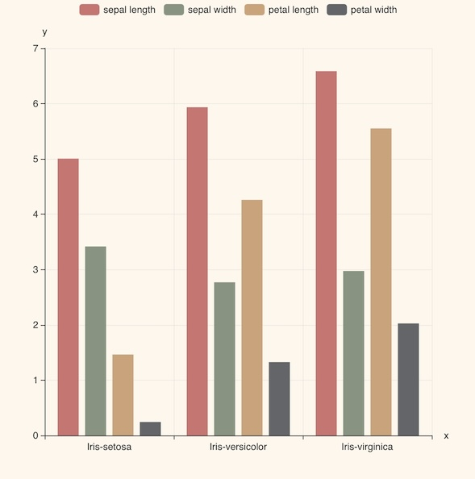
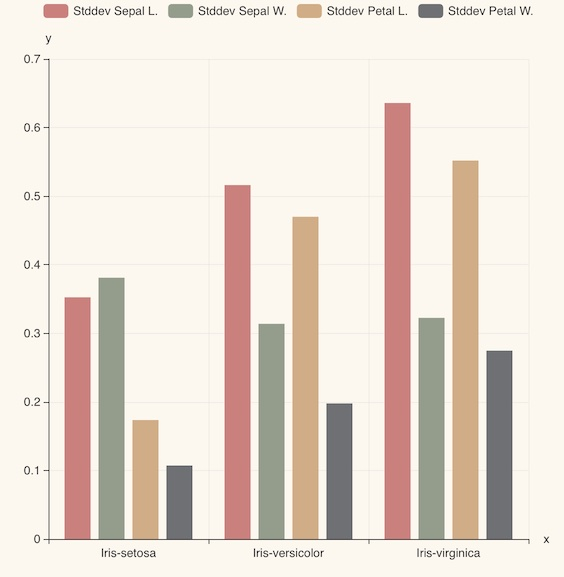

It is required to properly read (translate) data that is sent from sensors.
And also read and send data from database to other systems in demanded format.

The purpose of *TQL* is transforming data format.
This chapter shows how to do this without developing additional applications.



## Iris

The example tql code below gives a brief idea of what is TQL for.



- avg. values of each classes.
```js
CSV(file("https://machbase.com/assets/example/iris.csv"))
GROUP( by(value(4), "species"),
    avg(value(0), "Avg. Sepal L."),
    avg(value(1), "Avg. Sepal W."),
    avg(value(2), "Avg. Petal L."),
    avg(value(3), "Avg. Petal W.")
)
CHART_BAR()
```



- min, median, avg, max, stddev of sepal length of the setosa class.
```js
CSV(file("https://machbase.com/assets/example/iris.csv"))
FILTER( strToUpper(value(4)) == "IRIS-SETOSA")
GROUP( by(value(4)), 
    min(value(0), "Min"),
    median(value(0), "Median"),
    avg(value(0), "Avg"),
    max(value(0), "Max"),
    stddev(value(0), "StdDev.")
)
CHART_BAR()
```


