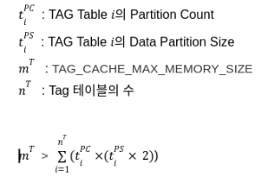

# 목차

* [Tag 테이블 Rollup의 시간단위 설정 기능 지원](#tag-테이블-rollup의-시간단위-설정-기능-지원)
* [다중 Tag 테이블 지원](#다중-tag-테이블-지원)
* [TAG 데이터 저장 구조 변경](#tag-데이터-저장-구조-변경)
* [Tag Table Index Memory 사용량 절감](#tag-table-index-memory-사용량-절감)
* [TAG ID기반 통계값 생성 / 조회](#tag-id기반-통계값-생성-/-조회)
* [JSON 타입 지원](#json-타입-지원)


# Tag 테이블 Rollup의 시간단위 설정 기능 지원
기존 버전에서는 Tag 테이블에 대한 기본 Rollup 작업이 1초, 1분, 1시간 단위로 수행되었다. 

하지만 Rollup 시간 단위를 변경할 수 없어서 데이터가 초 이상의 간격으로 들어올 경우 불필요한 자원을 사용하는 문제가 있었다.

Machbase 7.0 에서는 Rollup의 시간단위 설정 기능을 통해 사용자가 원하는 Rollup 만 생성할 수 있고 실행 주기도 원하는대로 설정할 수 있도록 하였다.

Rollup 생성 문법을 다음과 같다. 

**syntax**
```sql
-- 생성
CREATE ROLLUP rollup_name FROM tag_table_name INTERVAL timesepc;
    
timespec : integer time_unit
time_unit : SEC, MIN, HOUR 
  
-- 시작
EXEC ROLLUP_START(rollup_name);
  
-- 중지
EXEC ROLLUP_STOP(rollup_name);
  
-- 삭제
DROP ROLLUP rollup_name;
```

**example**
```sql
CREATE TAG TABLE tag (name VARCHAR(20) PRIMARY KEY, time DATETIME BASETIME, value DOUBLE SUMMARIZED);
  
CREATE ROLLUP rollup_30_sec FROM tag INTERVAL 30 SEC;
CREATE ROLLUP rollup_10_min FROM rollup_30_sec INTERVAL 10 MIN; 
CREATE ROLLUP rollup_1_hour FROM rollup_10_min INTERVAL 1 HOUR;
  
EXEC ROLLUP_START(rollup_30_sec);
EXEC ROLLUP_START(rollup_10_min);
EXEC ROLLUP_START(rollup_1_hour);
  
..
..
  
EXEC ROLLUP_STOP(rollup_1_hour);
EXEC ROLLUP_STOP(rollup_10_min);
EXEC ROLLUP_STOP(rollup_1_sec);
  
DROP ROLLUP rollup_1_hour;
DROP ROLLUP rollup_10_min;
DROP ROLLUP rollup_30_sec;
```

# 다중 Tag 테이블 지원
기존 버전에서는 한개의 Tag 테이블만 생성할 수 있는 문제를 해결하였다.

다중 Tag 테이블을 지원함으로써 다양한 스키마 형태로 들어오는 PLC 데이터를 효과적으로 저장할 수 있게 되었다.

테이블 이름 또한 자유롭게 지정할 수 있고 SYS가 아닌 일반 유저로 생성 가능하다.

**example**
```sql
CREATE TAG TABLE tag (tagid VARCHAR(50) PRIMARY KEY, time DATETIME BASETIME, value DOUBLE SUMMARIZED);
CREATE TAG TABLE imotbl (tagid VARCHAR(20) PRIMARY KEY, time DATETIME BASETIME, value DOUBLE SUMMARIZED, imo INTEGER, machine VARCHAR(10)) TAG_PARTITION_COUNT = 1, TAG_DATA_PART_SIZE = 20000000;
CREATE TAG TABLE shi985 (tagid VARCHAR(20) PRIMARY KEY, time DATETIME BASETIME, value DOUBLE SUMMARIZED, level INTEGER, itime DATETIME, strval VARCHAR(256)) TAG_PARTITION_COUNT = 2;
  
  
Mach> show tables;
USER_NAME             DB_NAME                                             TABLE_NAME                                          TABLE_TYPE 
-----------------------------------------------------------------------------------------------------------------------------------------------
SYS                   MACHBASEDB                                          IMOTBL                                              TAGDATA    
SYS                   MACHBASEDB                                          SHI985                                              TAGDATA    
SYS                   MACHBASEDB                                          TAG                                                 TAGDATA    
SYS                   MACHBASEDB                                          _IMOTBL_DATA_0                                      KEYVALUE   
SYS                   MACHBASEDB                                          _IMOTBL_META                                        LOOKUP     
SYS                   MACHBASEDB                                          _SHI985_DATA_0                                      KEYVALUE   
SYS                   MACHBASEDB                                          _SHI985_DATA_1                                      KEYVALUE   
SYS                   MACHBASEDB                                          _SHI985_META                                        LOOKUP     
SYS                   MACHBASEDB                                          _TAG_DATA_0                                         KEYVALUE   
SYS                   MACHBASEDB                                          _TAG_DATA_1                                         KEYVALUE   
SYS                   MACHBASEDB                                          _TAG_DATA_2                                         KEYVALUE   
SYS                   MACHBASEDB                                          _TAG_DATA_3                                         KEYVALUE   
SYS                   MACHBASEDB                                          _TAG_META                                           LOOKUP     
[13] row(s) selected.
```

# TAG 데이터 저장 구조 변경
디스크 사용량 감소를 위해 데이터 압축방식(delta compress)을 추가하고 칼럼단위로 저장하도록 데이터 구조가 변경되었다.

기존 version 대비 데이터사용량 비교 테스트 결과 디스크 사용량이 최대 37% 감소하였다.

|테스트환경|디스크사용량 감소|감소율|
|---------------|--------------|---------|
|Tag 10,000건<br>RowCount: 10억건<br>Rollup(O)|11,105 MB -> 6,907 MB|37.80% 감소|
|Tag 10,000건<br>RowCount: 10억건<br>Rollup(O)|11,007 MB -> 8,987 MB|18.35% 감소|
|Tag 10,000건<br>RowCount: 10억건<br>Rollup(O)|14,836 MB -> 12,752 MB|14.05% 감소|

# Tag Table Index Memory 사용량 절감
TAG테이블 생성 시 Memory를 Index Build를 위한 Index Memory를 고정적으로 과도하게 할당하여 Memory를 효율적으로 사용할 수 없는 문제가 있어

Index Memory를 필요한 시점에 필요한 만큼의 Memory만 동적으로 할당하는 방식으로 변경하여 복수의 TAG태이블을 생성 및 동작이 가능하도록 하였다.

7.0에서는 아래와 같은 테스트 환경에서 기존 version에 비해 최대 Memory 사용량이 약 40%가량 감소 했다.

 - 테스트환경: Tag 테이블 1개(partition 4개), Tag 10,000건 / 데이터 10억건 성능 테스트, PROCESS_MAX_SIZE 4GB

결과적으로 PROCESS_MAX_SIZE를 16GB로 설정 시 TAG 테이블(PARITITION 4개 기준)을 2개만 생성할 수 있었으나, 7.0에서는 동일설정 하에서 TAG테이블을

10개 이상 생성하여 사용할 수 있게 되었다.

**운영환경에 따른 메모리 설정 가이드**
초당 최대 입력 건수: append application은 TAG 테이블 수만큼 동작하는 상황에서 모든 append application의 초당 입력하는 데이터 합
(테이블당 append application 1개씩 동작)

|운영환경|||시스템 동작을 위한 최소 설정|||||시험장비사양|||
|TAG 테이블 수|테이블당 Tag 수|초당 최대 입력 건수|Session 수<br>(append 포함)|TAG_DATA_PART_SIZE|TAG_PARTITION_COUNT|PROCESS_MAX_SIZE|TAG_CACHE_MAX_MEMORY_SIZE|CPU|MEM|DISK|
|------------|--------------|-----------------|--------------------------|-------------------|-------------------|----------------|-------------------------|---|---|----|
|1|100,000|1,200,000/sec|4|16 M|1|2 GB|128 MB|16 cores|64 GB|SSD 1TB|
|1|100,000|1,000,000/sec|4|4 M|1|1 GB|32 MB|16 cores|64 GB|SSD 1TB|
|1|100,000|800,000/sec|4|1 M|1|512 MB|8 MB|16 cores|64 GB|SSD 1TB|
|8|100,000|4,000,000/sec|11|16 M|1|8 GB|256 MB|16 cores|64 GB|SSD 1TB|
|32|40,000|6,000,000/sec|35|16 M|1|16 GB|1024 MB|16 cores|64 GB|SSD 1TB|
|32|40,000|4,000,000/sec|35|4 M|1|8 GB|256 MB|16 cores|64 GB|SSD 1TB|
|64|20,000|4,000,000/sec|67|4 M|1|8 GB|512 MB|16 cores|64 GB|SSD 1TB|
|64|20,000|1,000,000/sec|67|1 M|1|4 GB|128 MB|16 cores|64 GB|SSD 1TB|
|128|10,000|4,000,000/sec|131|4 M|1|8 GB|1024 MB|16 cores|64 GB|SSD 1TB|
|128|10,000|1,000,000/sec|131|1 M|1|4 GB|256 MB|16 cores|64 GB|SSD 1TB|

TAG 테이블의 수에 비례하여 TAG_CACHE_MAX_MEMORY_SIZE설정 값이 높아져야하며, TAG 테이블의 생성시 TAG_CACHE_MAX_MEMORY_SIZE가 부족한 경우 테이블 생성이 실패할 수 있다.


TAG Parition이 4개이고, Partition Size가 16MB 인 경우

TAG_CACHE_MAX_MEMORY_SIZE는 적어도 128MB 보다 크게 설정 해야 한다.

128 MB = 4 * 16MB * 2


# TAG ID기반 통계값 생성 / 조회
Tag별 통계값 조회시 응답시간이 너무 긴 문제가 있으며 이를 개선하기 위해 Tag별 통계를 사전에 구성해 놓고,

조회의 편의성을 위해 view와 같은 형태로 조회 기능을 제공한다.

기존 version에서는 TAG통계조회시 data scan으로 인해 응답시간이 길었으나, 7.0에서는 필요한 통계정보를 사전에

구성함으로써 응답시간이 크게 단축 되었다.

**Tag 통계 정보**

|column|description|
|---------------|-----------------------|
|USER_ID|tag table user ID|
|TABLE_NAME|tag table name|
|TAG_ID|통계 정보의 Tag ID (사용자 관점에서는 Name이 출력된다)|
|MIN_TIME|현재까지 입력된 시간값의 최소치 (입력순서와 관계 없음)|
|MAX_TIME|현재까지 입력된 시간값의 최대치 (입력순서와 관계 없음)|
|MIN_VALUE|해당 tag의 Summarized 컬럼의 최소 값|
|MIN_VALUE_TIME|min_value와 같이 입력된 time|
|MAX_VALUE|해당 tag의 Summarized 컬럼의 최대 값|
|MAX_VALUE_TIME|max_value와 같이 입력된 time|
|ROW_COUNT|해당 Tag ID의 Row 개수|
|RECENT_ROW_TIME|마지막에 입력된 Row의 Basetime 컬럼값|

* query

Tag 테이블을 생성할때마다 통계정보를 저장하는 view 를 같이 생성한다. 통계정보를 조회하고자 할때 view 로부터 조회한다.

view table name : "V$name_STAT" . (name 은 tag 테이블 이름)

```sql
-- ex)
SELECT min_time, max_time FROM v$tag_stat WHERE tagid = 'tag-01';
  
-- ex) 여러개의 tag
SELECT min_time, max_time FROM v$tag_stat WHERE tagid IN ('tag-01', 'tag-02', 'tag-03');
```

min_time (또는 max_time) 에 입력된 value 를 알고싶다면 아래와 같이 조회가 가능하다.
```sql
SELECT value FROM tag WHERE tagid = 'tag-01' AND time = (SELECT min_time FROM v$tag_stat WHERE tagid = 'tag-01')
```

# JSON 타입 지원
**지원 배경**

최근 TEXT 타입의 데이터를 전송하는 장비도 사용되고 있다.

JSON 타입을 지원하면, TEXT 타입 뿐만 아니라 임의의 데이터 타입을 전송할 수 있다.

따라서, 칼럼의 갯수나 구조가 비정형으로 가능하기 때문에 확장성이 매우 높아지는 효과를 기대할 수 있다.

**장점**

* 별도의 확장 칼럼을 추가할 필요가 없기 때문에, 스키마 제약이 사라진다.
* 사용자가 임의의 데이터 타입을 마음대로 넣을 수 있다.
* JSON 데이터 특성으로 사용성 및 편의성이 높고, 데이터를 분리할 필요가 없다.

**데이터 범위**

* JSON data 길이 : 1 ~ 32768 (32K)
* JSON path 길이 : 1 ~ 512

```sql
CREATE TABLE jsontbl (name VARCHAR(20), jval JSON);
```

**데이터 삽입**

* JSON 포맷에 맞는 TEXT를 입력하여 데이터를 삽입할 수 있다.
* JSON 포맷에 맞지 않을 시, ERROR를 출력한다.

```sql
-- Single
INSERT INTO jsontbl VALUES("name1", '{"name":"test1"}');
-- Multi
INSERT INTO jsontbl VALUES("name2", '{"name":"test2", "value":123}');
-- Nested
INSERT INTO jsontbl VALUES("name3", '{"name":{"class1": "test3"}}');
-- Array
INSERT INTO jsontbl VALUES("name4", '{"myarray": [1, 2, 3, 4]}');
```

**데이터 추출**

* JSON 관련 함수를 사용하거나, Operator(->)를 사용하여 JSON 데이터를 부분적으로 추출할 수 있다.

```sql
-- 함수 사용
SELECT name, JSON_EXTRACT(jval, '$.name') FROM jsontbl;
SELECT name, JSON_EXTRACT_INTEGER(jval, '$.myarray') FROM jsontbl;
SELECT name, JSON_TYPEOF(jval, '$.name.class1') FROM jsontbl;
 
-- Operator(->) 사용
SELECT name, jval->'$.name' FROM jsontbl;
SELECT name, jval->'$.myarray' FROM jsontbl;
SELECT name, jval->'$.name.class1' FROM jsontbl;
```
