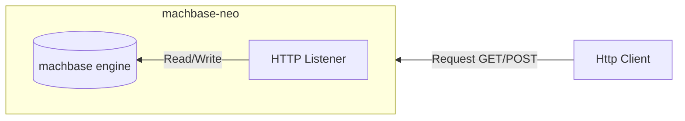
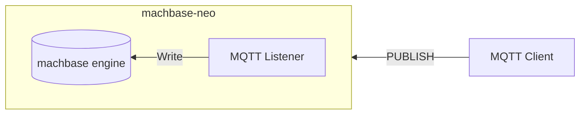
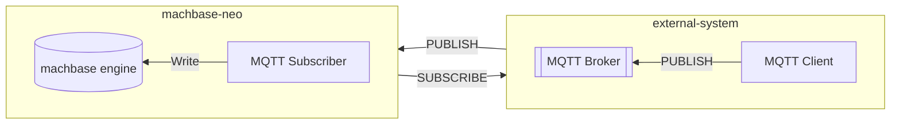
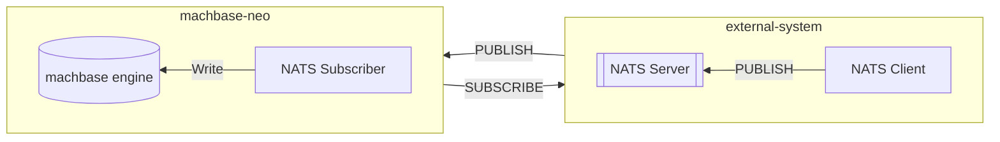
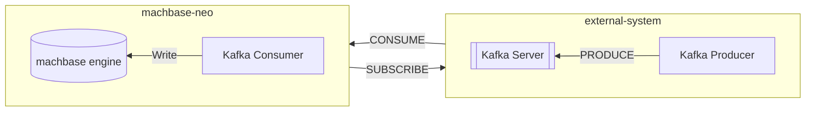

## 2023년 1분기

- [x] HTTP Server

- [x] MQTT Server

## 2023년 2분기

- [x] MQTT Subscriber

## 2023년 4분기
- [x] 데이터 시각화

  Apache ECharts 지원

## 2024년 2분기

- [X] NATS Subscriber

## 2024년 이후

- [ ] Kafka Consumer (계획 중)

- [ ] 위치 기반 시각화(계획 중)

   leaflet.js를 이용한 지리 정보 시각화 지원
