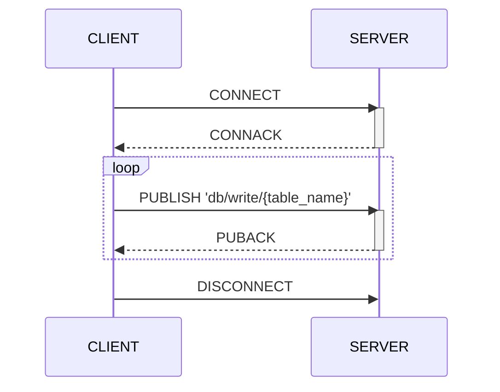
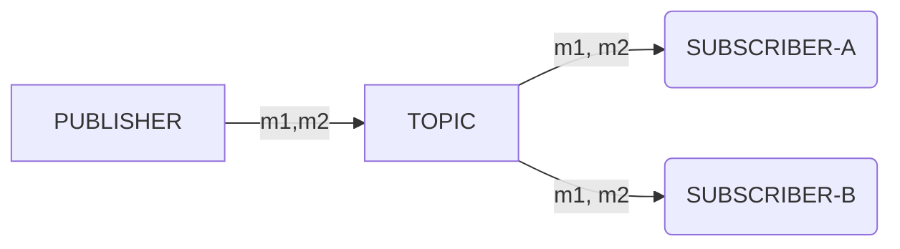
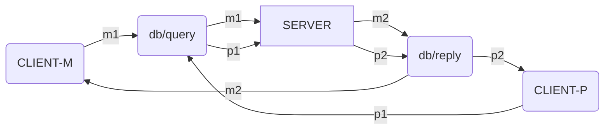
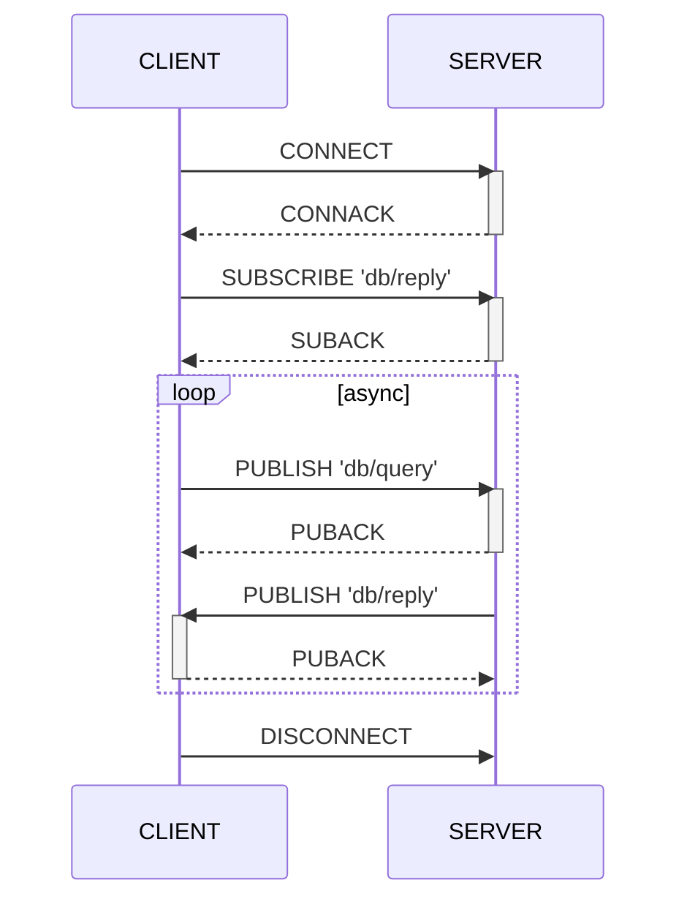

Machbase Neoは、MQTTプロトコルでデータを取り込み、検索できます。

MQTT APIは、Machbaseの`append`機能を活用して書き込み性能を最大化できる点でHTTPより優れています。MQTTはセッション中に接続を維持するため、クライアントはメッセージを繰り返し送信してデータを記録できます。また、MQTTは多くのIoT機器で広く使用されています。

そのため、センサーが収集したデータをMachbase Neoに送信するには、MQTTが最も効率的です。



## データ書き込みの流れ {#데이터-쓰기-흐름}

以下の例は、MQTTクライアント（`mosquitto_pub`）でデータを効率的に記録する方法を示しています。
送信先トピックは、`db/write/`にテーブル名を連結した文字列である必要があります。

## データ検索の流れ {#데이터-조회-흐름}

一般的なMQTTブローカーは、以下の図のように特定のトピックを購読するすべてのクライアントにメッセージを配信します。パブリッシャーが`TOPIC`に`M1`、`M2`を送信すると、`SUBSCRIBER-A`と`SUBSCRIBER-B`は同じメッセージを受信します。

Machbase Neoも標準のMQTTブローカーと同様に、すべてのメッセージを購読者に配信します。ただし、クエリの応答メッセージは、要求したクライアントにのみ送信します。つまり、パブリッシャーとサブスクライバーが同じ接続（MQTTでいうセッション）を共有している場合にのみ、クエリ結果が配信されます。Machbase Neoはメッセージブローカーとして動作しますが、クエリ結果のメッセージを他の購読者には複製しません。

たとえば、`CLIENT-M`と`CLIENT-P`が同じ`TOPIC`を購読しているとします。
サーバーが`CLIENT-M`宛てのメッセージ`M1`、`M2`を`TOPIC`に送信すると、これらは`CLIENT-M`にのみ届き、
`CLIENT-P`は、サーバーが直接指定した`P1`、`P2`を受信します。別のクライアント`PUBLISHER-X`が`TOPIC`に`X1`を送信すると、サーバーには届きますが、他のクライアントにはこのイベントは通知されません。

アプリケーションからMQTTでMachbase Neoにクエリを実行するには、まず`db/reply`を購読する必要があります。
以下のシーケンス図は、`CLIENT`がQoS 1を使用する例です。
Machbase Neoは、MQTT v3.1.1のQoS 0と1に対応しています。

`CONNECT`と`CONNACK`でMQTTセッションを確立した後、`db/query`にクエリメッセージを送信する前に、必ず`db/reply`を購読してください。購読していない場合は、クエリ結果を受信できません。

メッセージ➍、➎は、MQTTプロトコルの特性によりサーバーから非同期に送信されます。そのため、クライアントアプリケーションでは、この2つのメッセージが特定の順序で届くことを前提にしないでください。


クライアントがデータの書き込みのために`db/append`にのみ発行する場合は、`db/reply`の購読は不要です。このトピックはクエリ結果を受信する場合にのみ必要です。


## この章の内容 {#이-장에서-안내하는-내용}


