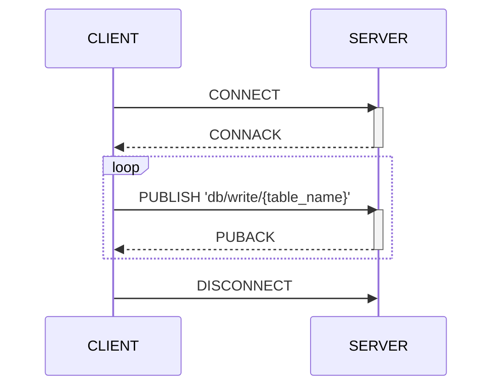
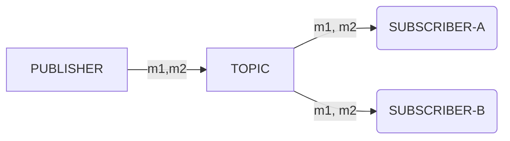
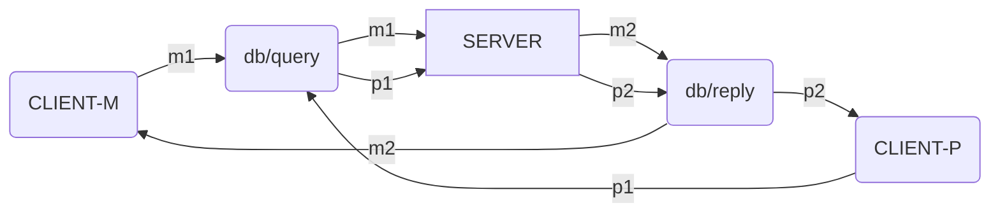
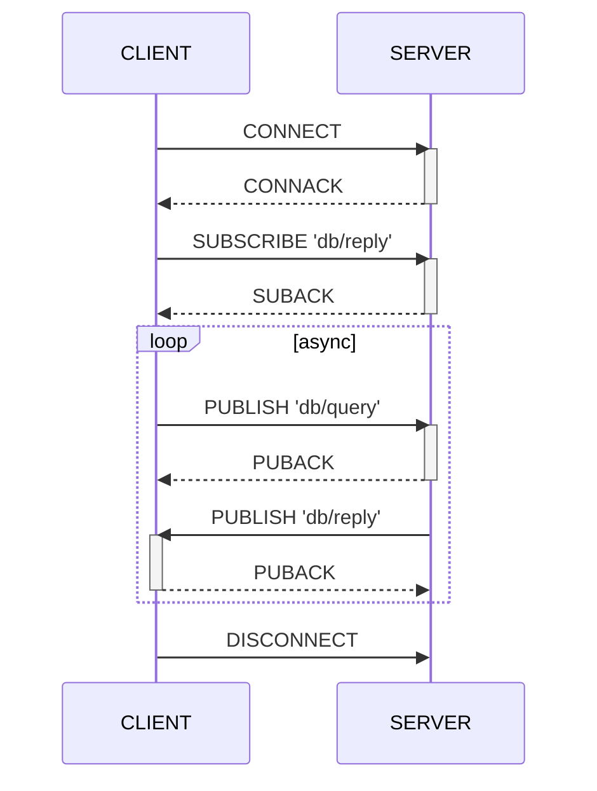

Machbase Neo는 MQTT 프로토콜을 통해 데이터를 적재하고 조회할 수 있습니다.

MQTT API가 HTTP보다 뛰어난 점은 Machbase의 `append` 기능을 활용해 데이터 쓰기 성능을 극대화한다는 것입니다. MQTT는 세션 동안 연결을 유지하는 프로토콜이므로 클라이언트가 반복적으로 메시지를 보내 데이터를 기록할 수 있습니다. 또한 MQTT는 대부분의 IoT 장비에서 널리 사용됩니다.

따라서 센서가 수집한 데이터를 Machbase Neo로 전송하는 가장 효율적인 방법은 MQTT를 사용하는 것입니다.



## 데이터 쓰기 흐름

아래 예시는 MQTT 클라이언트(`mosquitto_pub`)로 데이터를 효율적으로 기록하는 방법을 보여줍니다.
목적지 토픽은 `db/write/` + 테이블 이름이어야 합니다.

## 데이터 조회 흐름

일반적인 MQTT 브로커는 아래 그림처럼 특정 토픽을 구독하는 모든 클라이언트에 메시지를 전달합니다. 발행자가 `TOPIC`으로 `M1`, `M2` 메시지를 보내면 `SUBSCRIBER-A`와 `SUBSCRIBER-B` 모두 동일한 메시지를 수신합니다.

Machbase Neo도 표준 MQTT 브로커처럼 모든 메시지를 구독자에게 전달합니다. 단, 쿼리 응답 메시지는 요청한 클라이언트에게만 전송됩니다. 즉, 퍼블리셔와 서브스크라이버가 동일한 연결(또는 MQTT 용어로 세션)을 공유할 때에만 쿼리 결과가 전달됩니다. 따라서 Machbase Neo는 메시지 브로커로 동작하지만, 쿼리 결과 메시지는 다른 구독자에게 복제되지 않습니다.

예를 들어 `CLIENT-M`과 `CLIENT-P`가 동일한 `TOPIC`을 구독하고 있다고 가정해 보겠습니다.
서버가 `CLIENT-M`에게 전달할 메시지 `M1`, `M2`를 `TOPIC`으로 전송하면 이 메시지는 `CLIENT-M`에게만 전달되고,
`CLIENT-P`는 서버가 직접 지정한 `P1`, `P2`를 받습니다. 다른 클라이언트 `PUBLISHER-X`가 `TOPIC`으로 `X1`을 전송하면 이는 서버로 전달되지만 다른 클라이언트는 이 이벤트를 알 수 없습니다.

애플리케이션이 MQTT로 Machbase Neo에 쿼리를 실행하려면 먼저 `db/reply`를 구독해야 합니다.
아래 시퀀스 다이어그램은 `CLIENT`가 QoS 1을 사용하는 상황을 예로 들었습니다.
참고로 Machbase Neo는 MQTT v3.1.1의 QoS 0과 1을 지원합니다.

`CONNECT`와 `CONNACK`으로 MQTT 세션이 수립된 뒤에는 `db/query`로 쿼리 메시지를 보내기 전에 반드시 `db/reply`를 구독해야 합니다. 그렇지 않으면 쿼리 결과를 받을 수 없습니다.

메시지 ➍, ➎는 MQTT 프로토콜 특성상 서버에서 비동기적으로 전송됩니다. 따라서 클라이언트 애플리케이션은 두 메시지가 특정 순서로 도착한다는 가정하에 구현하면 안 됩니다.


클라이언트가 데이터를 쓰기 위해 `db/append`에만 발행한다면 `db/reply`를 구독할 필요가 없습니다. 이 토픽은 쿼리 결과를 받을 때만 필요합니다.


## 이 장에서 안내하는 내용


