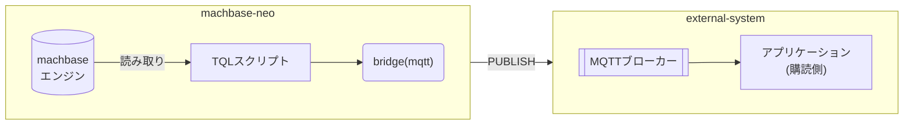
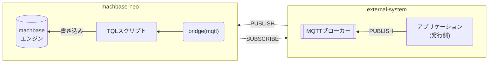
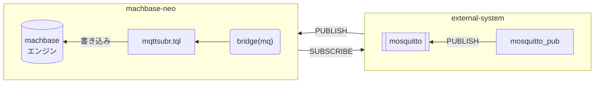

MQTTブリッジを使うと、machbase-neoと外部のMQTTブローカーの間でメッセージを送受信できます。


MQTTベースのプラットフォームにmachbase-neoを導入する場合、ブリッジを接続すれば、既存システムを変更する必要はありません。


- 外部MQTTブローカーへのメッセージ送信



- 外部MQTTブローカーからのメッセージ受信



## 外部MQTTブリッジの登録 {#외부-mqtt-브리지-등록}

ブリッジを登録します。

```
bridge add -t mqtt my_mqtt broker=127.0.0.1:1883 id=client-id;
```

MQTTブリッジは、machbase-neoから外部ブローカーへの接続方法を定義します。
メッセージの受信については、後述のサブスクライバーを参照してください。

使用できる接続オプション

| オプション           | 説明                          | 例         |
| :-----------     | :---------------------------------   | :-------------  |
| `broker`         | ブローカーアドレス。接続先が冗長化されている場合は、複数の「broker」オプションを使用します | `broker=192.0.1.100:1883` |
| `id`             | クライアントID                            |                 |
| `username`       | ユーザー名                           |                 |
| `password`       | パスワード                           |                 |
| `keepalive`      | 期間形式のkeepalive         | `keepalive=30s` |
| `cleansession`   | クリーンセッション                   | `cleansession=1` `cleansession=false` |
| `cafile`         | CA証明書（`*.pem`）のファイルパス            |  *TLS*          |
| `key`            | クライアント秘密鍵（`*.pem`）のファイルパス |  *TLS*          |
| `cert`           | クライアント証明書（`*.pem`）のファイルパス |  *TLS*          |

> `cafile`、`key`、`cert`をすべて指定すると、TLSによる安全なMQTT接続が有効になります。

## メッセージの送信 {#메시지-전송}

まず、`mosquitto_sub`をデバッグモード（`-d`）で実行します。
machbase-neoが`neo/messages`トピックにメッセージを発行すると、ブローカー経由で受信します。

```sh
mosquitto_sub -d -h 127.0.0.1 -p 1883 -i client-app -t neo/messages
Client client-app sending CONNECT
Client client-app received CONNACK (0)
Client client-app sending SUBSCRIBE (Mid: 1, Topic: neo/messages, QoS: 0, Options: 0x00)
Client client-app received SUBACK
Subscribed (mid: 1): 0
```

ブリッジの`publish()`関数を呼び出す*TQL*スクリプトを作成します。


**TIMER**
この例は、簡単にするため`FAKE()`で手動実行します。
ブリッジの`publish`機能は、[タイマー](/neo/timer/)と組み合わせて自動的にデータを送信する場合に便利です。


現在のJavaScriptランタイムでは、次のTQLで同じ外部ブローカーに送信できます。
この例は`mqtt`モジュールでクライアント接続を作成します。
登録済みブリッジの`publish()`を使う旧Tengoの例は、後述の参照用コードに残しています。

```js
SCRIPT({
  const mqtt = require('mqtt');
  const values = [0, 2.5, 5, 7.5, 10];
  const client = new mqtt.Client({servers: ['tcp://127.0.0.1:1883']});
  let published = 0;
  const timeout = setTimeout(() => client.close(), 5000);
  client.on('open', () => {
    for (const value of values) {
      client.publish('neo/messages', 'The message number is ' + value, {qos: 1});
      $.yield(value);
    }
  });
  client.on('published', () => {
    if (++published === values.length) {
      clearTimeout(timeout);
      client.close();
    }
  });
  client.on('error', err => {
    console.error(err);
    clearTimeout(timeout);
    client.close();
  });
})
CSV()
```

<details>
<summary>旧Tengoの例（現在のランタイムでは実行できません）</summary>

```js {linenos=table,hl_lines=[4,5],linenostart=1}
FAKE(linspace(0,10, 5))
SCRIPT("tengo", {
  ctx := import("context")
  br := ctx.bridge("my_mqtt")
  br.publish("neo/messages", "The message number is "+ctx.value(0))
  ctx.yieldKey(ctx.key(), ctx.value()...)
})
CSV()
```

</details>

スクリプトを実行すると、`mosquitto_sub`が受信したメッセージを直ちに出力します。

```sh
mosquitto_sub -d -h 127.0.0.1 -p 1883 -i client-app -t neo/messages
... omit ...
Client client-app received PUBLISH (d0, q0, r0, m0, 'neo/messages', ... (23 bytes))
The message number is 0
Client client-app received PUBLISH (d0, q0, r0, m0, 'neo/messages', ... (25 bytes))
The message number is 2.5
Client client-app received PUBLISH (d0, q0, r0, m0, 'neo/messages', ... (23 bytes))
The message number is 5
Client client-app received PUBLISH (d0, q0, r0, m0, 'neo/messages', ... (25 bytes))
The message number is 7.5
Client client-app received PUBLISH (d0, q0, r0, m0, 'neo/messages', ... (24 bytes))
The message number is 10
```

## メッセージ受信とサブスクライバー {#메시지-수신---구독자}

次に、MQTTブローカーから受信したメッセージを、ブリッジ経由でデータベースに保存する例を示します。
デモでは、`mosquitto`をブローカー、`mosquitto_pub`をMQTTクライアントとして使用し、外部システムを模擬します。



### 1. MQTTブローカーの起動 {#1-mqtt-브로커-실행}

machbase-neoのMQTTブリッジは、MQTT v3.1.1に準拠するブローカーと互換性があります。
ブローカーがない場合は、デモ用に*mosquitto*をインストールして実行してください。 [https://mosquitto.org](https://mosquitto.org)

```sh
$ mosquitto -p 1883

1691466522: mosquitto version 2.0.15 starting
1691466522: Using default config.
1691466522: Starting in local only mode. Connections will only be possible from clients running on this machine.
1691466522: Create a configuration file which defines a listener to allow remote access.
1691466522: For more details see https://mosquitto.org/documentation/authentication-methods/
1691466522: Opening ipv4 listen socket on port 1883.
1691466522: Opening ipv6 listen socket on port 1883.
1691466522: mosquitto version 2.0.15 running
```

### 2. ブリッジの登録 {#2-브리지-등록}

machbase-neoシェルで、以下のコマンドを実行してブリッジを追加します。

```
bridge add -t mqtt my_mqtt broker=127.0.0.1:1883 id=demo;
```

このコマンドは、指定したブローカーへの接続方法を定義します。

```
machbase-neo» bridge list;
╭─────────┬──────────┬─────────────────────────────────╮
│ NAME    │ TYPE     │ CONNECTION                      │
├─────────┼──────────┼─────────────────────────────────┤
│ my_mqtt │ mqtt     │ broker=127.0.0.1:1883 id=demo   │
╰─────────┴──────────┴─────────────────────────────────╯
```

`my_mqtt`ブリッジの登録に成功すると、machbase-neoがブローカーに接続し、
mosquittoログに、以下の接続記録が表示されます。
ネットワーク障害やブローカー障害があっても、machbase-neoは定期的に再接続を試みます。

```
1691466529: New connection from 127.0.0.1:65440 on port 1883.
1691466529: New client connected from 127.0.0.1:65440 as demo (p2, c1, k30).
```

### 3-A. 書き込み記述子を使用するサブスクライバー {#3-a-쓰기-디스크립터를-사용하는-구독자}

ブリッジとテーブルを関連付けるサブスクライバーを登録します。

```
subscriber add --autostart mqtt_subr my_mqtt iot/sensor db/append/EXAMPLE:csv;
```

`subscriber list`で登録を確認します。

```
┌───────────┬─────────┬────────────┬───────────────────────┬───────────┬─────────┐
│ NAME      │ BRIDGE  │ TOPIC      │ DESTINATION           │ AUTOSTART │ STATE   │
├───────────┼─────────┼────────────┼───────────────────────┼───────────┼─────────┤
│ MQTT_SUBR │ my_mqtt │ iot/sensor │ db/append/EXAMPLE:csv │ true      │ RUNNING │
└───────────┴─────────┴────────────┴───────────────────────┴───────────┴─────────┘
```

各引数の意味は以下のとおりです。
- `--autostart`: machbase-neoの起動時にサブスクライバーを自動起動します。省略すると、手動で開始・停止できます。
- `mqtt_subr`: サブスクライバー名です。
- `my_mqtt`: 使用するブリッジ名です。
- `iot/sensor`: 購読するトピック（MQTTのトピック構文を使用）。
- `db/append/EXAMPLE:csv`: 書き込み記述子です。入力データがCSVで、`EXAMPLE`テーブルにappendモードで書き込むことを示します。

書き込み記述子の代わりに、*TQL*スクリプトのパスも指定できます。後半で例を示します。

書き込み記述子の形式は以下のとおりです。

```
db/{method}/{table_name}:{format}:{compress}?{options}
```

**method**

方式は`append`と`write`の2つです。ストリーミング環境では、`append`を推奨します。
- `append`: appendモードで書き込み
- `write`: INSERT SQLで書き込み

**table_name**

対象テーブル名（大文字と小文字を区別しない）

**format**

- `json`（既定）
- `csv`

**compress**

現在は`gzip`に対応しています。`:{compress}`を省略すると、圧縮しません。

**options**

`?`の後に、URLエンコードした追加オプションを指定できます。

| 名前          | 既定値      | 説明                                                    |
| :------------ | :----------- | :------------------------------------------------------------- |
| `timeformat`  | `ns`         | 時刻の形式：s、ms、us、ns                                     |
| `tz`          | `UTC`        | タイムゾーン：UTC、Local、地域指定                        |
| `delimiter`   | `,`          | CSV区切り文字。CSV以外の場合は無視                   |
| `heading`     | `false`      | CSVにヘッダーがある場合、`true`で先頭行をスキップ |

- `db/append/EXAMPLE:csv?timeformat=s&heading=true`
- `db/write/EXAMPLE:csv:gzip?timeformat=s`

#### `mosquitto_pub`でのメッセージ発行 {#mosquitto_pub으로-메시지-발행}

以下の`data.csv`ファイルを用意します。

```csv
mqtt-demo.temp,1691470297923000000,34.1
mqtt-demo.humidity,1691470297923000000,67.8
``` 

`mosquitto_pub`で、`data.csv`をMQTTブローカーに発行します。

```sh
mosquitto_pub -d -h 127.0.0.1 -p 1883 -t iot/sensor -f data.csv
```

保存したデータを検索します。

```sh
machbase-neo» select * from example where name in ('mqtt-demo.temp', 'mqtt-demo.humidity');
╭────────┬────────────────────┬─────────────────────────┬───────────╮
│ ROWNUM │ NAME               │ TIME(LOCAL)             │ VALUE     │
├────────┼────────────────────┼─────────────────────────┼───────────┤
│      1 │ mqtt-demo.temp     │ 2023-08-08 13:51:37.923 │ 34.100000 │
│      2 │ mqtt-demo.humidity │ 2023-08-08 13:51:37.923 │ 67.800000 │
╰────────┴────────────────────┴─────────────────────────┴───────────╯
```


### 3-B. TQLを使用するサブスクライバー {#3-b-tql을-사용하는-구독자}

#### データ書き込み用TQLスクリプト {#데이터-작성용-tql-스크립트}

machbase-neoの*TQL*エディターで、以下のコードを`mqttsubr.tql`として保存します。

```js {linenos=table,hl_lines=[1,4]}
CSV(payload())
MAPVALUE(1, parseTime(value(1), "ns"))
MAPVALUE(2, parseFloat(value(2)))
APPEND( table("example") )
```

machbase-neoシェルで、次のコマンドを使い、ブリッジとTQLスクリプトを関連付けるサブスクライバーを追加します。

```sh
subscriber add --autostart --qos 1 mqttsubr my_mqtt iot/sensor /mqttsubr.tql;
```

各オプションの意味は以下のとおりです。
- `--autostart`: machbase-neoとともに自動起動
- `--qos 1`: QoS 1で購読（MQTTブリッジはQoS 0と1に対応）
- `mqttsubr`: サブスクライバー名
- `my_mqtt`: 使用するブリッジ名
- `iot/sensor`: 購読トピック。`#`、`+`などの標準MQTTトピック構文に対応


`--autostart`を指定したため、登録したサブスクライバーが`RUNNING`状態であることを確認します。

```
machbase-neo» subscriber list;
╭──────────┬─────────┬────────────┬───────────────┬───────────┬─────────╮
│ NAME     │ BRIDGE  │ TOPIC      │ TQL           │ AUTOSTART │ STATE   │
├──────────┼─────────┼────────────┼───────────────┼───────────┼─────────┤
│ MQTTSUBR │ my_mqtt │ iot/sensor │ /mqttsubr.tql │ true      │ RUNNING │
╰──────────┴─────────┴────────────┴───────────────┴───────────┴─────────╯
```

#### `mosquitto_pub`でのメッセージ発行 {#mosquitto_pub으로-메시지-발행-1}

前述と同じ`data.csv`を使用します。

```csv
mqtt-demo.temp,1691470297923000000,34.1
mqtt-demo.humidity,1691470297923000000,67.8
``` 

`mosquitto_pub`でデータを発行します。

```sh
mosquitto_pub -d -h 127.0.0.1 -p 1883 -t iot/sensor -f data.csv
```

保存したデータを検索します。

```sh
machbase-neo» select * from example where name in ('mqtt-demo.temp', 'mqtt-demo.humidity');
╭────────┬────────────────────┬─────────────────────────┬───────────╮
│ ROWNUM │ NAME               │ TIME(LOCAL)             │ VALUE     │
├────────┼────────────────────┼─────────────────────────┼───────────┤
│      1 │ mqtt-demo.temp     │ 2023-08-08 13:51:37.923 │ 34.100000 │
│      2 │ mqtt-demo.humidity │ 2023-08-08 13:51:37.923 │ 67.800000 │
╰────────┴────────────────────┴─────────────────────────┴───────────╯
```
