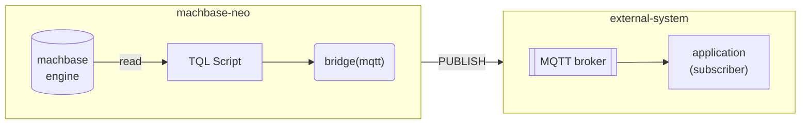
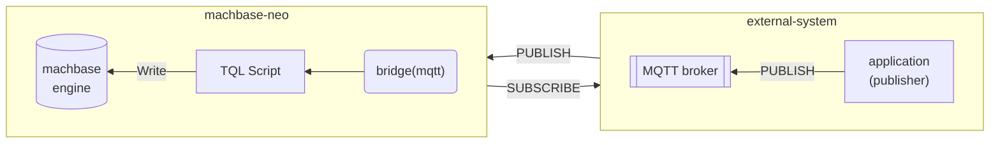
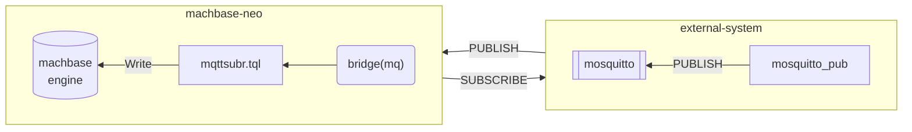

MQTT 브리지를 사용하면 machbase-neo가 외부 MQTT 브로커와 메시지를 주고받을 수 있습니다.


MQTT 기반 플랫폼에서 machbase-neo를 도입할 때 브리지만 연결하면 기존 시스템을 변경할 필요가 없습니다.


- Send messages to external MQTT broker



- Receive messages from external MQTT broker



## 외부 MQTT 브리지 등록

브리지를 등록합니다.

```
bridge add -t mqtt my_mqtt broker=127.0.0.1:1883 id=client-id;
```

MQTT 브리지는 machbase-neo가 외부 브로커에 접속하는 방식을 정의합니다.
메시지를 수신하려면 아래 구독자 섹션을 참고하십시오.

사용 가능한 연결 옵션

| Option           | Description                          | example         |
| :-----------     | :---------------------------------   | :-------------  |
| `broker`         | broker address, If the broker has redundant access points, use multiple "broker" options | `broker=192.0.1.100:1883` |
| `id`             | client id                            |                 |
| `username`       | username                             |                 |
| `password`       | password                             |                 |
| `keepalive`      | keepalive in duration format         | `keepalive=30s` |
| `cleansession`   | cleansession                         | `cleansession=1` `cleansession=false` |
| `cafile`         | ca cert (`*.pem`) file path            |  *TLS*          |
| `key`            | client private key (`*.pem`) file path |  *TLS*          |
| `cert`           | client certificate (`*.pem`) file path |  *TLS*          |

> `cafile`, `key`, `cert` 옵션을 모두 지정하면 TLS를 통한 보안 MQTT 연결이 활성화됩니다.

## 메시지 전송

먼저 `mosquitto_sub`를 디버그 모드(`-d`)로 실행합니다.
machbase-neo가 `neo/messages` 토픽으로 메시지를 발행하면 해당 브로커를 통해 메시지를 수신합니다.

```sh
mosquitto_sub -d -h 127.0.0.1 -p 1883 -i client-app -t neo/messages                                            1 ↵
Client client-app sending CONNECT
Client client-app received CONNACK (0)
Client client-app sending SUBSCRIBE (Mid: 1, Topic: neo/messages, QoS: 0, Options: 0x00)
Client client-app received SUBACK
Subscribed (mid: 1): 0
```

이제 브리지의 `publish()` 함수를 호출하는 *TQL* 스크립트를 작성합니다.


**TIMER**
예시는 간단히 `FAKE()`를 사용해 수동 실행하지만,
브리지의 `publish` 기능은 [Timer](/neo/timer/)와 결합해 자동으로 데이터를 전송할 때 더욱 강력합니다.


```js {linenos=table,hl_lines=[4,5],linenostart=1}
FAKE(linspace(0,10, 5))
SCRIPT("tengo", {
  ctx := import("context")
  br := ctx.bridge("my_mqtt")
  br.publish("neo/messages", "The message number is "+ctx.value(0))
  ctx.yieldKey(ctx.key(), ctx.value()...)
})
CSV()
```

스크립트를 실행하면 `mosquitto_sub`가 수신한 메시지를 즉시 출력합니다.

```sh
mosquitto_sub -d -h 127.0.0.1 -p 1883 -i client-app -t neo/messages                                            1 ↵
... omit ...
Client client-app received PUBLISH (d0, q0, r0, m0, 'neo/messages', ... (23 bytes))
The message number is 0
Client client-app received PUBLISH (d0, q0, r0, m0, 'neo/messages', ... (25 bytes))
The message number is 2.5
Client client-app received PUBLISH (d0, q0, r0, m0, 'neo/messages', ... (23 bytes))
The message number is 5
Client client-app received PUBLISH (d0, q0, r0, m0, 'neo/messages', ... (25 bytes))
The message number is 7.5
Client client-app received PUBLISH (d0, q0, r0, m0, 'neo/messages', ... (24 bytes))
The message number is 10
```

## 메시지 수신 - 구독자

이번에는 MQTT 브로커에서 메시지를 받아 브리지를 통해 데이터베이스에 저장하는 예제를 살펴봅니다.
시연에서는 `mosquitto`를 브로커로, `mosquitto_pub`을 MQTT 클라이언트로 사용해 외부 시스템을 모사합니다.



### 1. MQTT 브로커 실행

machbase-neo의 MQTT 브리지는 MQTT v3.1.1을 준수하는 모든 브로커와 호환됩니다.
브로커가 없다면 데모용으로 *mosquitto*를 설치하여 실행하십시오. [https://mosquitto.org](https://mosquitto.org)

```sh
$ mosquitto -p 1883

1691466522: mosquitto version 2.0.15 starting
1691466522: Using default config.
1691466522: Starting in local only mode. Connections will only be possible from clients running on this machine.
1691466522: Create a configuration file which defines a listener to allow remote access.
1691466522: For more details see https://mosquitto.org/documentation/authentication-methods/
1691466522: Opening ipv4 listen socket on port 1883.
1691466522: Opening ipv6 listen socket on port 1883.
1691466522: mosquitto version 2.0.15 running
```

### 2. 브리지 등록

machbase-neo 셸에서 아래 명령으로 브리지를 추가합니다.

```
bridge add -t mqtt my_mqtt broker=127.0.0.1:1883 id=demo;
```

해당 명령은 지정한 브로커에 연결하는 방법을 정의합니다.

```
machbase-neo» bridge list;
╭─────────┬──────────┬─────────────────────────────────╮
│ NAME    │ TYPE     │ CONNECTION                      │
├─────────┼──────────┼─────────────────────────────────┤
│ my_mqtt │ mqtt     │ broker=127.0.0.1:1883 id=demo   │
╰─────────┴──────────┴─────────────────────────────────╯
```

브리지 `my_mqtt`가 성공적으로 등록되면 machbase-neo가 브로커에 연결하고,
mosquitto 로그에 아래와 같은 연결 기록이 표시됩니다.
네트워크 문제 또는 브로커 장애가 있더라도 machbase-neo는 주기적으로 재연결을 시도합니다.

```
1691466529: New connection from 127.0.0.1:65440 on port 1883.
1691466529: New client connected from 127.0.0.1:65440 as demo (p2, c1, k30).
```

### 3-A. 쓰기 디스크립터를 사용하는 구독자

브리지와 테이블을 연결할 구독자를 등록합니다.

```
subscriber add --autostart mqtt_subr my_mqtt iot/sensor db/append/EXAMPLE:csv;
```

Execute `subscriber list` to confirm the registration.

```
┌───────────┬─────────┬────────────┬───────────────────────┬───────────┬─────────┐
│ NAME      │ BRIDGE  │ TOPIC      │ DESTINATION           │ AUTOSTART │ STATE   │
├───────────┼─────────┼────────────┼───────────────────────┼───────────┼─────────┤
│ MQTT_SUBR │ my_mqtt │ iot/sensor │ db/append/EXAMPLE:csv │ true      │ RUNNING │
└───────────┴─────────┴────────────┴───────────────────────┴───────────┴─────────┘
```

각 인자의 의미는 다음과 같습니다.
- `--autostart`: machbase-neo 시작 시 구독자를 자동 실행합니다. 생략하면 수동으로 시작/중지할 수 있습니다.
- `mqtt_subr`: 구독자 이름입니다.
- `my_mqtt`: 사용할 브리지 이름입니다.
- `iot/sensor`: 구독할 토픽(MQTT 토픽 문법 사용).
- `db/append/EXAMPLE:csv`: 쓰기 디스크립터입니다. 입력 데이터가 CSV이며 `EXAMPLE` 테이블에 append 모드로 기록함을 의미합니다.

쓰기 디스크립터 대신 *TQL* 스크립트 경로를 지정할 수도 있습니다. 예제는 후반부에 소개합니다.

쓰기 디스크립터 형식은 다음과 같습니다.

```
db/{method}/{table_name}:{format}:{compress}?{options}
```

**method**

방법(method)은 `append`, `write` 두 가지이며 스트림 환경에서는 `append`를 권장합니다.
- `append`: append 모드로 기록
- `write`: INSERT SQL로 기록

**table_name**

대상 테이블 이름(대소문자 무시)

**format**

- `json` (default)
- `csv`

**compress**

현재는 `gzip`을 지원합니다. `:{compress}`를 생략하면 압축하지 않습니다.

**options**

추가로 `?` 뒤에 URL 인코딩된 옵션을 지정할 수 있습니다.

| Name          | Default      | Description                                                    |
| :------------ | :----------- | :------------------------------------------------------------- |
| `timeformat`  | `ns`         | Time format: s, ms, us, ns                                     |
| `tz`          | `UTC`        | Time Zone: UTC, Local and location spec                        |
| `delimiter`   | `,`          | CSV delimiter, ignored if content is not csv                   |
| `heading`     | `false`      | If CSV contains header line, set `true` to skip the first line |

- `db/append/EXAMPLE:csv?timeformat=s&heading=true`
- `db/write/EXAMPLE:csv:gzip?timeformat=s`

#### `mosquitto_pub`으로 메시지 발행

다음과 같은 `data.csv` 파일을 준비합니다.

```csv
mqtt-demo.temp,1691470297923000000,34.1
mqtt-demo.humidity,1691470297923000000,67.8
``` 

`mosquitto_pub`으로 `data.csv`를 MQTT 브로커에 발행합니다.

```sh
mosquitto_pub -d -h 127.0.0.1 -p 1883 -t iot/sensor -f data.csv
```

저장된 데이터를 조회합니다.

```sh
machbase-neo» select * from example where name in ('mqtt-demo.temp', 'mqtt-demo.humidity');
╭────────┬────────────────────┬─────────────────────────┬───────────╮
│ ROWNUM │ NAME               │ TIME(LOCAL)             │ VALUE     │
├────────┼────────────────────┼─────────────────────────┼───────────┤
│      1 │ mqtt-demo.temp     │ 2023-08-08 13:51:37.923 │ 34.100000 │
│      2 │ mqtt-demo.humidity │ 2023-08-08 13:51:37.923 │ 67.800000 │
╰────────┴────────────────────┴─────────────────────────┴───────────╯
```


### 3-B. TQL을 사용하는 구독자

#### 데이터 작성용 TQL 스크립트

machbase-neo *TQL* 에디터에서 아래 코드를 `mqttsubr.tql`로 저장합니다.

```js {linenos=table,hl_lines=[1,4]}
CSV(payload())
MAPVALUE(1, parseTime(value(1), "ns"))
MAPVALUE(2, parseFloat(value(2)))
APPEND( table("example") )
```

machbase-neo 셸에서 다음 명령으로 브리지와 TQL 스크립트를 연결하는 구독자를 추가합니다.

```sh
subscriber add --autostart --qos 1 mqttsubr my_mqtt iot/sensor /mqttsubr.tql;
```

각 옵션의 의미는 아래와 같습니다.
- `--autostart`: machbase-neo와 함께 자동 실행
- `--qos 1`: QoS 1로 구독 (MQTT 브리지는 QoS 0과 1을 지원)
- `mqttsubr`: 구독자 이름
- `my_mqtt`: 사용할 브리지 이름
- `iot/sensor`: 구독 토픽으로, `#`, `+` 등 표준 MQTT 토픽 문법을 지원


`--autostart` 옵션을 사용했으므로 등록한 구독자가 `RUNNING` 상태인지 확인합니다.

```
machbase-neo» subscriber list;
╭──────────┬─────────┬────────────┬───────────────┬───────────┬─────────╮
│ NAME     │ BRIDGE  │ TOPIC      │ TQL           │ AUTOSTART │ STATE   │
├──────────┼─────────┼────────────┼───────────────┼───────────┼─────────┤
│ MQTTSUBR │ my_mqtt │ iot/sensor │ /mqttsubr.tql │ true      │ RUNNING │
╰──────────┴─────────┴────────────┴───────────────┴───────────┴─────────╯
```

#### `mosquitto_pub`으로 메시지 발행

앞서와 동일한 `data.csv` 파일을 사용합니다.

```csv
mqtt-demo.temp,1691470297923000000,34.1
mqtt-demo.humidity,1691470297923000000,67.8
``` 

`mosquitto_pub`으로 데이터를 발행합니다.

```sh
mosquitto_pub -d -h 127.0.0.1 -p 1883 -t iot/sensor -f data.csv
```

저장된 데이터를 조회합니다.

```sh
machbase-neo» select * from example where name in ('mqtt-demo.temp', 'mqtt-demo.humidity');
╭────────┬────────────────────┬─────────────────────────┬───────────╮
│ ROWNUM │ NAME               │ TIME(LOCAL)             │ VALUE     │
├────────┼────────────────────┼─────────────────────────┼───────────┤
│      1 │ mqtt-demo.temp     │ 2023-08-08 13:51:37.923 │ 34.100000 │
│      2 │ mqtt-demo.humidity │ 2023-08-08 13:51:37.923 │ 67.800000 │
╰────────┴────────────────────┴─────────────────────────┴───────────╯
```
