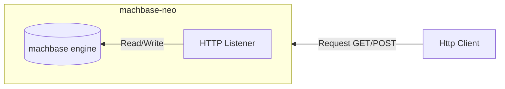
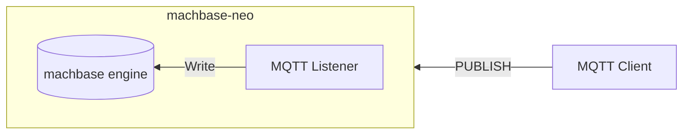
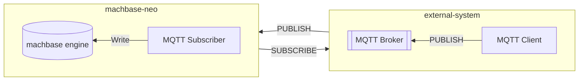
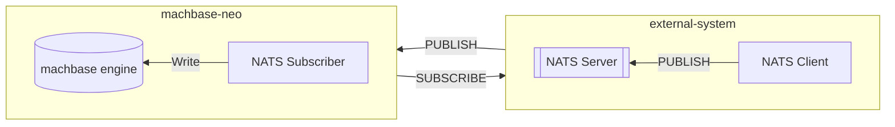
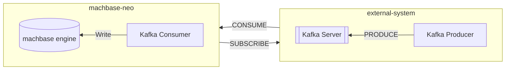

## 2023 Q1

- [x] HTTP Server

- [x] MQTT Server

## 2023 Q2

- [x] MQTT Subscriber

## 2023 Q4
- [x] Data visualization

  Support Apache echarts.

## 2024 Q2

- [X] NATS Subscriber

## Later 2024

- [ ] Kafka Consumer (planning...)

- [ ] Geo Location visualization (planning...)

   Support leaflet.js for geo-location data visualization.

