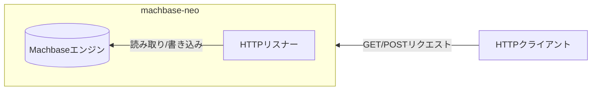
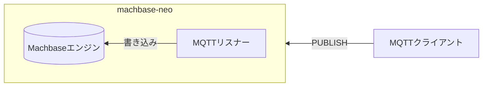
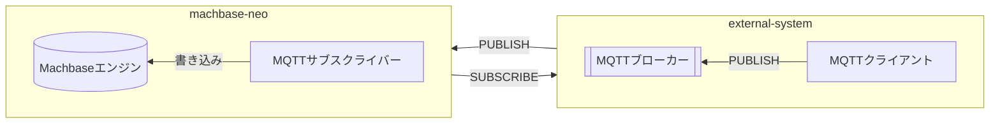
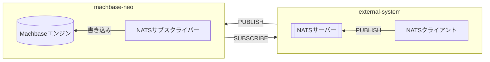
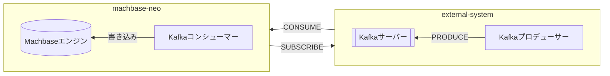

## 2023年第1四半期 {#2023년-1분기}

- [x] HTTPサーバー

- [x] MQTTサーバー

## 2023年第2四半期 {#2023년-2분기}

- [x] MQTTサブスクライバー

## 2023年第4四半期 {#2023년-4분기}
- [x] データの可視化

  Apache EChartsへの対応

## 2024年第2四半期 {#2024년-2분기}

- [X] NATSサブスクライバー

## 2024年以降 {#2024년-이후}

- [ ] Kafkaコンシューマー (計画中)

- [ ] 位置情報に基づく可視化(計画中)

   leaflet.jsによる地理情報の可視化に対応
