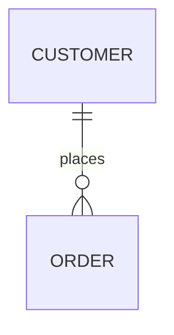

## 基本型 {#기본-타입}

TQLは、文字列（`string`）、数値（`number`）、ブール値（`boolean`）、時刻（`time`）型をサポートします。

### 文字列（string） {#문자열string}

文字列は、一般的なプログラミング言語と同様に、単一引用符（'）、二重引用符（"）、バッククォートで囲みます。中括弧で囲むこともできます。
バッククォートの文字列は、引用符を含む長いSQL文のように、複数行にわたる文字列を記述する場合に便利です。

複数行のテキストにバッククォートや中括弧（`{`、`}`）が含まれ、文字列の区切りと衝突する場合は、タグ付きリテラルを使用できます。

- タグ付きバッククォート：`` `<<TAG ... TAG` ``
- タグ付き中括弧ブロック：`{<<TAG ... TAG}`

どちらの形式も内容をrawテキストとして扱い、タグを記述した終了行で閉じます。

*例)* バックスラッシュによる単一引用符のエスケープ（`\'`）

```js {linenos=table}
SQL( 'select * from example where name=\'temperature\' limit 10' )
CSV()
```

*例)* 二重引用符の文字列

```js {linenos=table}
SQL( "select * from example where name='temperature' limit 10" )
CSV()
```

*例)* バッククォート（`）を使い、エスケープせずに複数行のSQL文を記述

```js {linenos=table}
SQL( `select *
      from example
      where name='temperature'
      limit 10` )
CSV()
```

```js {linenos=table}
SCRIPT(`<<JS
// '{' を返す関数
function a () { return '{' }
JS`)
CSV()
```

~~~js {linenos=table}
MARKDOWN({<<MD

MD})
~~~

二重中括弧（`{{ }}`）を使うと、TQLスクリプトでJSON文字列を簡単に記述できます。引用符をエスケープする必要はありません。

以下の2つの文字列式は同じ値です。

```js {linenos=table}
STRING({{
    "name": "Connan",
    "hired": true,
    "company": {
        "name":"acme",
        "employee": 123
    }
}})
CSV()
```

```js {linenos=table}
STRING(`{
    "name": "Connan",
    "hired": true,
    "company": {
        "name":"acme",
        "employee": 123
    }
}`)
CSV()
```

### 数値（number） {#숫자number}

すべての数値リテラルは64ビット浮動小数点数として処理されます。

```js {linenos=table}
SQL_SELECT( 'time', 'value', from('example', 'temperature'), limit(10))
CSV()
```

```js {linenos=table}
FAKE( oscillator( freq(12.34, 20), range("now", "1s", "100ms")) )
CSV()
```

### ブール値（boolean） {#불리언boolean}

ブール定数は `true` と `false` です。

```js {linenos=table}
FAKE( linspace(0, 1, 1))
CSV( heading(false) )
```

### 時刻（time） {#시간time}

時刻型の値は、`time()`、`parseTime()` 関数で生成するか、SQLクエリ結果の `DATETIME` カラムから取得できます。

### タイムゾーン（timeZone） {#타임존timezone}

タイムゾーン型の値は、`tz()` 関数で生成します。

例：`tz('UTC')`、`tz('Local')`、`tz('Asia/Seoul')`

### リスト（list） {#리스트list}

リストは他の値の配列で、`list()` 関数で生成します。

例：`list(1, 2, 3)`

### 辞書（dictionary） {#딕셔너리dictionary}

辞書は（文字列の）名前と値のペアの集合で、`dict()` 関数で生成します。

例：`dict("name", "pi", "value", 3.14)`

## 文の記述規則 {#문장-작성-규칙}

文字列、数値、ブール値のリテラル定数を除き、すべての文は関数呼び出しの形式で記述します。

```js
// コメントは '//' で記述します。
SQL_SELECT(
    'time', 'value',
    from('example', 'temperature'),
    limit(10)
)
CSV()
```

## SRCとSINK {#src와-sink}

すべての `.tql` スクリプトは、レコードを生成する**ソース（SRC）**文1つで始める必要があります。
たとえば、`SQL()`、`SQL_SELECT()`、および `$.yield()`、`$.yieldKey()` でレコードを生成する `SCRIPT()` がソースになります。
最後の文は、結果をエンコードするか、データベースに書き込む**シンク（SINK）**文である必要があります。
たとえば、`CSV()`、`JSON()`、`INSERT()`、`APPEND()`、およびすべての `CHART()` 系関数がシンクになります。

## MAP関数 {#map-함수}

ソースとシンクの間には、0個以上のMAP関数を配置できます。
MAP関数の名前はすべて大文字です。一方、小文字で始まるキャメルケースの関数は、他のMAP関数の引数として使用します。

```js {linenos=table,hl_lines=["6-7"],linenostart=1}
SQL_SELECT(
    'time', 'value',
    from('example', 'temperature'),
    limit(10)
)
DROP(5)
TAKE(5)
CSV()
```

## パラメーター（param） {#파라미터param}

外部アプリケーションがHTTPで `.tql` スクリプトを呼び出す際に、クエリパラメーターとして引数を渡せます。
TQLスクリプトでは、`param()` 関数でクエリパラメーターの値を読み取ります。

以下のスクリプトを `hello2.tql` として保存すると、アプリケーションはHTTP GETメソッドで `http://127.0.0.1:5654/db/tql/hello2.tql?name=temperature&count=10` を呼び出して、このスクリプトを実行できます。
このとき、`param('name')` は `"temperature"`、`param('count')` は文字列 `"10"` を返します。

```js {linenos=table}
SQL_SELECT(
    'time', 'value',
    from('example', param('name')),
    limit( param('count') )
)
CSV()
```

**例**

{}

### `param()` の使用 {#param-사용}

次のコードを `param.tql` として保存します。

```js
SQL( `select * from example where name = ?`, param('name'))
CSV()
```

### クライアントからのGETリクエスト {#클라이언트-get-요청}

`curl` コマンドで、クエリパラメーターを付けてTQLファイルを呼び出します。

```
curl "http://127.0.0.1:5654/db/tql/param.tql?name=TAG0"
```

{}

## 演算子 {#연산자}

### 算術演算子 {#산술-연산자}

算術演算子は、加算 `+`、減算 `-`、乗算 `*`、除算 `/` を実行します。

```js {linenos=table,hl_lines=[2]}
FAKE(linspace(1, 10, 5))
MAPVALUE( 1, value(0) * 100 )
CSV()
```

```csv
1,100
3.25,325
5.5,550
7.75,775
10,1000
```

### 剰余演算子 {#나머지-연산자}

`%` で表す剰余演算子（モジュロ演算子）は、算術演算子です。
整数除算の余りを返します。

```js {linenos=table,hl_lines=[2]}
FAKE(arrange(1, 10, 1))
FILTER(value(0) % 3 == 0)
CSV()
```

```csv
3
6
9
```

### 文字列の連結 {#문자열-연결}

`+` 演算子のオペランドが文字列の場合、連結した文字列を返します。

```js {linenos=table,hl_lines=[4]}
FAKE(json({
    ["hello", "world"]
}))
MAPVALUE(2, value(0) + " " + value(1) + "?")
CSV()
```

```csv
hello,world,hello world?
```

### 比較演算子 {#비교-연산자}

| 比較         | 演算子 | 説明 |
| :--------------------- | :--  | :-- |
| 等しい               | `==` | オペランドが等しい場合にTRUEを返す |
| 等しくない             | `!=` | オペランドが等しくない場合にTRUEを返す |
| より大きい           | `>`  | 左辺の値が右辺の値より大きいかを判定する |
| 以上  | `>=` | 左辺の値が右辺の値以上かを判定する |
| より小さい              | `<`  | 左辺の値が右辺の値より小さいかを判定する |
| 以下     | `<=` | 左辺の値が右辺の値以下かを判定する |

```js {linenos=table,hl_lines=[2]}
FAKE(linspace(1, 5, 5))
FILTER( value(0) >= 4 )
CSV()
```

```csv
4
5
```

### 論理演算子 {#논리-연산자}

論理演算子は、論理積、論理和、否定を実行します。

| 論理演算 | 演算子 | 説明 |
| :-- | :--  | :-- |
| AND | `&&` | 両方のオペランドがTRUEの場合にTRUEを返す |
| OR  | `\|\|` | いずれかのオペランドがTRUEの場合にTRUEを返す |
| NOT | `!`  | 1つのオペランドを受け取る |

```js {linenos=table,hl_lines=[2]}
FAKE(linspace(1, 5, 5))
FILTER( value(0) > 0  && mod(value(0), 2) == 0 )
CSV()
```

```csv
2
4
```

### IN演算子 {#in-연산자}

`A in (args...)` は、argsに `A` が含まれる場合にtrue、それ以外の場合にfalseを返します。

```js {linenos=table,hl_lines=[7]}
FAKE(json({
    ["A", 1.0],
    ["B", 1.5],
    ["C", 2.0],
    ["D", 2.5]
}))
FILTER( value(0) in ("A", "C") )
CSV()
```

```js {linenos=table,hl_lines=[7]}
FAKE(json({
    ["A", 1.0],
    ["B", 1.5],
    ["C", 2.0],
    ["D", 2.5]
}))
FILTER( value(1) in (1.5, 2.5) )
CSV()
```

### 三項演算子 {#삼항-연산자}

三項演算子 `? :` は、他のプログラミング言語のif-else文に似ています。
if-else文と同じ手順で、条件に応じて値を選択します。

- `param('name')` が定義されているかどうか

```js {linenos=table,hl_lines=[4]}
SQL_SELECT(
    'time', 'value',
    from('example',
        param('name') == NULL ? 'temperature' : param('name')
    ),
    limit( param('count') ?? 10 )
)
CSV()
```

- 条件に応じた値の変更

```js {linenos=table,hl_lines=[2]}
FAKE(linspace(1, 5, 5))
MAPVALUE(0, mod(value(0), 2) == 0 ? value(0)*10 : value(0))
CSV()
```

```
1
20
3
40
5
```

### Nil合体演算子 {#nil-병합-연산자}

`??` 演算子は左右のオペランドを受け取ります。左辺が定義されている場合はその値を返し、未定義の場合は右辺の値を返します。
以下は `??` 演算子の一般的な使用例です。呼び出し元がクエリパラメーターを指定しなかった場合、右辺の値を既定値として使用します。

```js {linenos=table,hl_lines=[3]}
SQL_SELECT(
    'time', 'value',
    from('example', param('name') ?? 'temperature'),
    limit( param('count') ?? 10 )
)
CSV()
```

> 
> TQLスクリプトを保存すると、エディターの右上にリンクアイコンが表示されます。クリックすると、スクリプトファイルのアドレスをコピーできます。

**例**

{}

#### `??` の使用 {#-사용}

以下のコードを `param-default.tql` として保存します。

```js
SQL( `select * from example limit ?`, param('limit') ?? 1)
CSV()
```

#### HTTP GET {#http-get}

クエリパラメーターなしのGETリクエスト

```sh
curl http://127.0.0.1:5654/db/tql/param-default.tql
```

```csv
TAG0,1628694000000000000,10
```

#### パラメーター付きHTTP GET {#파라미터를-포함한-http-get}

クエリパラメーター付きのGETリクエスト

```sh
curl http://127.0.0.1:5654/db/tql/param-default.tql?limit=2
```

```csv
TAG0,1628694000000000000,10
TAG0,1628780400000000000,11
```

{}

## プラグマ {#프라그마}

`//+ name=value` ディレクティブは、Machbase NeoによるTQLスクリプトの実行方法を指定します。

### log-level {#log-level}



ログレベルを `[TRACE | DEBUG | INFO | WARN | ERROR]` のいずれかに設定します。
既定値は `ERROR` です。HTTPおよびMQTT APIから呼び出した場合、ほとんどのログメッセージを抑制します。

```js {linenos=table,hl_lines=["1"]}
//+ log-level=TRACE
SQL(`select * from my_table where name = ?`, param("name"))
WHEN(true, doLog('hello world'))
CSV()
```

### sql-thread-lock {#sql-thread-lock}



このプラグマは、指定した `SQL()` を専用のネイティブスレッドで実行します。
スレッドはTQLスクリプトの終了時に終了します。
SRCの `SQL()` でのみ動作します。

100個のHTTPクライアントが同時にTQLファイルを実行する内部性能テストでは、
このオプションを有効にするとレスポンスのレイテンシーが35%増加しますが、メモリ解放の遅延が大幅に減少しました。

```js {linenos=table,hl_lines=["1"]}
//+ sql-thread-lock
SQL(`select * from my_table where name = ?`, param("name"))
WHEN(true, doLog('hello world'))
CSV()
```
