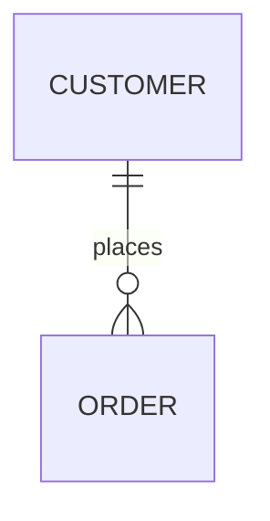

## 기본 타입

TQL은 문자열(`string`), 숫자(`number`), 불리언(`boolean`)과 시간(`time`) 타입을 지원합니다.

### 문자열(string)

문자열은 일반적인 프로그래밍 언어처럼 작은따옴표('), 큰따옴표("), 백틱으로 감싸며, 중괄호로 감쌀 수도 있습니다.
백틱 문자열은 따옴표를 포함한 긴 SQL 문처럼 여러 줄에 걸친 문자열을 작성할 때 편리합니다.

여러 줄 텍스트에 백틱이나 중괄호(`{`, `}`)가 포함되어 문자열 경계와 충돌하는 경우에는 태그 기반 리터럴을 사용할 수 있습니다.

- 태그 백틱: `` `<<TAG ... TAG` ``
- 태그 중괄호 블록: `{<<TAG ... TAG}`

두 형식 모두 내부 내용을 raw 텍스트로 취급하며, 태그가 있는 종료 줄에서 닫힙니다.

*예)* 백슬래시로 작은따옴표 이스케이프(`\'`)

```js {linenos=table}
SQL( 'select * from example where name=\'temperature\' limit 10' )
CSV()
```

*예)* 큰따옴표 문자열

```js {linenos=table}
SQL( "select * from example where name='temperature' limit 10" )
CSV()
```

*예)* 백틱(`)을 사용해 이스케이프 없이 여러 줄 SQL 문 작성

```js {linenos=table}
SQL( `select *
      from example
      where name='temperature'
      limit 10` )
CSV()
```

```js {linenos=table}
SCRIPT(`<<JS
// this is a function return '{'
function a () { return '{' }
JS`)
CSV()
```

~~~js {linenos=table}
MARKDOWN({<<MD

MD})
~~~

중괄호 두 개(`{{ }}`)를 사용하면 TQL 스크립트에서 JSON 문자열을 간편하게 작성할 수 있으며, 따옴표를 이스케이프할 필요가 없습니다.

아래 두 문자열 표현식은 같은 값입니다.

```js {linenos=table}
STRING({{
    "name": "Connan",
    "hired": true,
    "company": {
        "name":"acme",
        "employee": 123
    }
}})
CSV()
```

```js {linenos=table}
STRING(`{
    "name": "Connan",
    "hired": true,
    "company": {
        "name":"acme",
        "employee": 123
    }
}`)
CSV()
```

### 숫자(number)

모든 숫자 리터럴은 64비트 부동소수점으로 처리됩니다.

```js {linenos=table}
SQL_SELECT( 'time', 'value', from('example', 'temperature'), limit(10))
CSV()
```

```js {linenos=table}
FAKE( oscillator( freq(12.34, 20), range("now", "1s", "100ms")) )
CSV()
```

### 불리언(boolean)

불리언 상수는 `true`, `false`입니다.

```js {linenos=table}
FAKE( linspace(0, 1, 1))
CSV( heading(false) )
```

### 시간(time)

시간 타입 값은 `time()`, `parseTime()` 함수로 생성하거나 SQL 쿼리 결과의 `DATETIME` 컬럼에서 얻을 수 있습니다.

### 타임존(timeZone)

타임존 타입 값은 `tz()` 함수로 생성합니다.

예) `tz('UTC')`, `tz('Local')`, `tz('Asia/Seoul')`

### 리스트(list)

리스트는 다른 값들의 배열이며, `list()` 함수로 생성합니다.

예) `list(1, 2, 3)`

### 딕셔너리(dictionary)

딕셔너리는 (문자열) 이름과 값의 쌍으로 이루어진 집합이며, `dict()` 함수로 생성합니다.

예) `dict("name", "pi", "value", 3.14)`

## 문장 작성 규칙

문자열·숫자·불리언 리터럴 상수를 제외한 모든 문장은 함수 호출 형태여야 합니다.

```js
// A comment line starts with '//'
SQL_SELECT(
    'time', 'value',
    from('example', 'temperature'),
    limit(10)
)
CSV()
```

## SRC와 SINK

모든 `.tql` 스크립트는 레코드를 생성하는 **소스(SRC)** 문장 하나로 시작해야 합니다.
예를 들어 `SQL()`, `SQL_SELECT()`, 그리고 `$.yield()`, `$.yieldKey()`로 레코드를 생성하는 `SCRIPT()`가 소스가 될 수 있습니다.
마지막 문장은 결과를 인코딩하거나 데이터베이스에 기록하는 **싱크(SINK)** 문장이어야 합니다.
예를 들어 `CSV()`, `JSON()`, `INSERT()`, `APPEND()`와 모든 `CHART()` 계열 함수가 싱크가 될 수 있습니다.

## MAP 함수

소스와 싱크 사이에는 0개 이상의 MAP 함수를 넣을 수 있습니다.
MAP 함수의 이름은 모두 대문자이며, 반대로 소문자로 시작하는 카멜 표기 함수는 다른 MAP 함수의 인자로 사용됩니다.

```js {linenos=table,hl_lines=["6-7"],linenostart=1}
SQL_SELECT(
    'time', 'value',
    from('example', 'temperature'),
    limit(10)
)
DROP(5)
TAKE(5)
CSV()
```

## 파라미터(param)

외부 애플리케이션이 HTTP로 `.tql` 스크립트를 호출할 때 쿼리 파라미터로 인자를 전달할 수 있습니다.
TQL 스크립트에서는 `param()` 함수로 쿼리 파라미터 값을 읽습니다.

아래 스크립트를 `hello2.tql`로 저장하면 애플리케이션은 HTTP GET 메서드로 `http://127.0.0.1:5654/db/tql/hello2.tql?name=temperature&count=10`을 호출해 이 스크립트를 실행할 수 있습니다.
이때 `param('name')`은 `"temperature"`, `param('count')`는 문자열 `"10"`을 반환합니다.

```js {linenos=table}
SQL_SELECT(
    'time', 'value',
    from('example', param('name')),
    limit( param('count') )
)
CSV()
```

**예제**

{}

### `param()` 사용

아래 코드를 `param.tql`로 저장합니다.

```js
SQL( `select * from example where name = ?`, param('name'))
CSV()
```

### 클라이언트 GET 요청

`curl` 명령으로 쿼리 파라미터를 붙여 TQL 파일을 호출합니다.

```
curl "http://127.0.0.1:5654/db/tql/param.tql?name=TAG0"
```

{}

## 연산자

### 산술 연산자

산술 연산자는 덧셈 `+`, 뺄셈 `-`, 곱셈 `*`, 나눗셈 `/` 연산을 수행합니다.

```js {linenos=table,hl_lines=[2]}
FAKE(linspace(1, 10, 5))
MAPVALUE( 1, value(0) * 100 )
CSV()
```

```csv
1,100
3.25,325
5.5,550
7.75,775
10,1000
```

### 나머지 연산자

`%`로 표기하는 나머지 연산자(모듈로 연산자)는 산술 연산자입니다.
정수 나눗셈의 나머지를 반환합니다.

```js {linenos=table,hl_lines=[2]}
FAKE(arrange(1, 10, 1))
FILTER(value(0) % 3 == 0)
CSV()
```

```csv
3
6
9
```

### 문자열 연결

`+` 연산자의 피연산자가 문자열이면 두 문자열을 연결한 문자열을 반환합니다.

```js {linenos=table,hl_lines=[4]}
FAKE(json({
    ["hello", "world"]
}))
MAPVALUE(2, value(0) + " " + value(1) + "?")
CSV()
```

```csv
hello,world,hello world?
```

### 비교 연산자

| 비교 연산       | 연산자 | 설명 |
| :-------------- | :--  | :-- |
| 같음            | `==` | 피연산자가 같으면 TRUE를 반환합니다 |
| 같지 않음       | `!=` | 피연산자가 같지 않으면 TRUE를 반환합니다 |
| 보다 큼         | `>`  | 왼쪽 피연산자의 값이 오른쪽 값보다 큰지 검사합니다 |
| 크거나 같음     | `>=` | 왼쪽 피연산자의 값이 오른쪽 값보다 크거나 같은지 검사합니다 |
| 보다 작음       | `<`  | 왼쪽 피연산자의 값이 오른쪽 값보다 작은지 검사합니다 |
| 작거나 같음     | `<=` | 왼쪽 피연산자의 값이 오른쪽 값보다 작거나 같은지 검사합니다 |

```js {linenos=table,hl_lines=[2]}
FAKE(linspace(1, 5, 5))
FILTER( value(0) >= 4 )
CSV()
```

```csv
4
5
```

### 논리 연산자

논리 연산자는 AND, OR, NOT 연산을 수행합니다.

| 논리 연산 | 연산자 | 설명 |
| :-- | :--  | :-- |
| AND | `&&` | 두 피연산자가 모두 TRUE이면 TRUE를 반환합니다 |
| OR  | `\|\|` | 피연산자 중 하나라도 TRUE이면 TRUE를 반환합니다 |
| NOT | `!`  | 피연산자를 하나만 받습니다 |

```js {linenos=table,hl_lines=[2]}
FAKE(linspace(1, 5, 5))
FILTER( value(0) > 0  && mod(value(0), 2) == 0 )
CSV()
```

```csv
2
4
```

### IN 연산자

`A in (args...)`는 args에 `A`가 포함되어 있으면 true를, 그렇지 않으면 false를 반환합니다.

```js {linenos=table,hl_lines=[7]}
FAKE(json({
    ["A", 1.0],
    ["B", 1.5],
    ["C", 2.0],
    ["D", 2.5]
}))
FILTER( value(0) in ("A", "C") )
CSV()
```

```js {linenos=table,hl_lines=[7]}
FAKE(json({
    ["A", 1.0],
    ["B", 1.5],
    ["C", 2.0],
    ["D", 2.5]
}))
FILTER( value(1) in (1.5, 2.5) )
CSV()
```

### 삼항 연산자

삼항 연산자 `? :`는 다른 프로그래밍 언어의 if-else 문과 비슷하며,
if-else 문과 같은 방식으로 조건에 따라 값을 선택합니다.

- `param('name')`이 정의되었는지 여부

```js {linenos=table,hl_lines=[4]}
SQL_SELECT(
    'time', 'value',
    from('example',
        param('name') == NULL ? 'temperature' : param('name')
    ),
    limit( param('count') ?? 10 )
)
CSV()
```

- 조건에 따른 값 변경

```js {linenos=table,hl_lines=[2]}
FAKE(linspace(1, 5, 5))
MAPVALUE(0, mod(value(0), 2) == 0 ? value(0)*10 : value(0))
CSV()
```

```
1
20
3
40
5
```

### Nil 병합 연산자

`??` 연산자는 왼쪽과 오른쪽 피연산자를 받습니다. 왼쪽 피연산자가 정의되어 있으면 그 값을 반환하고, 정의되어 있지 않으면 오른쪽 피연산자를 반환합니다.
아래 예시는 `??` 연산자의 일반적인 사용 사례입니다. 호출자가 쿼리 파라미터를 전달하지 않으면 오른쪽 피연산자가 기본값으로 사용됩니다.

```js {linenos=table,hl_lines=[3]}
SQL_SELECT(
    'time', 'value',
    from('example', param('name') ?? 'temperature'),
    limit( param('count') ?? 10 )
)
CSV()
```

> 
> TQL 스크립트를 저장하면 편집기 우측 상단에 링크 아이콘이 표시됩니다. 클릭하면 스크립트 파일의 주소를 복사할 수 있습니다.

**예제**

{}

#### `??` 사용

아래 코드를 `param-default.tql`로 저장합니다.

```js
SQL( `select * from example limit ?`, param('limit') ?? 1)
CSV()
```

#### HTTP GET

쿼리 파라미터 없이 GET 요청을 보냅니다.

```sh
curl http://127.0.0.1:5654/db/tql/param-default.tql
```

```csv
TAG0,1628694000000000000,10
```

#### 파라미터를 포함한 HTTP GET

쿼리 파라미터를 붙여 GET 요청을 보냅니다.

```sh
curl http://127.0.0.1:5654/db/tql/param-default.tql?limit=2
```

```csv
TAG0,1628694000000000000,10
TAG0,1628780400000000000,11
```

{}

## 프라그마

`//+ name=value` 지시문은 Machbase Neo가 TQL 스크립트를 어떻게 실행할지 지정합니다.

### log-level



로그 레벨을 `[TRACE | DEBUG | INFO | WARN | ERROR]` 중 하나로 설정합니다.
기본값은 `ERROR`이며, HTTP와 MQTT API에서 호출할 때 대부분의 로그 메시지를 출력하지 않습니다.

```js {linenos=table,hl_lines=["1"]}
//+ log-level=TRACE
SQL(`select * from my_table where name = ?`, param("name"))
WHEN(true, doLog('hello world'))
CSV()
```

### sql-thread-lock



이 프라그마를 지정하면 `SQL()`이 전용 네이티브 스레드에서 실행되며,
이 스레드는 TQL 스크립트가 끝나면 종료됩니다.
SRC인 `SQL()`에서만 동작합니다.

100개의 HTTP 클라이언트가 동시에 TQL 파일을 실행하는 내부 성능 테스트에서는
이 옵션을 켜면 응답 지연 시간이 35% 늘어나지만, 메모리 해제 지연은 크게 줄었습니다.

```js {linenos=table,hl_lines=["1"]}
//+ sql-thread-lock
SQL(`select * from my_table where name = ?`, param("name"))
WHEN(true, doLog('hello world'))
CSV()
```
